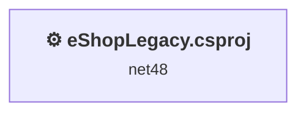
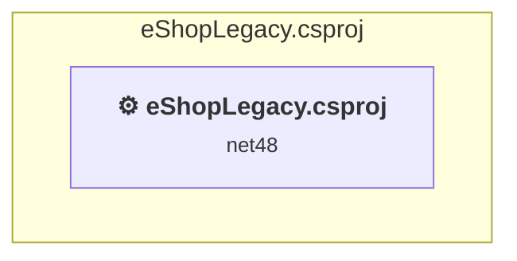

# Projects and dependencies analysis

This document provides a comprehensive overview of the projects and their dependencies in the context of upgrading to .NETCoreApp,Version=v10.0.

## Table of Contents

- [Executive Summary](#executive-Summary)
  - [Highlevel Metrics](#highlevel-metrics)
  - [Projects Compatibility](#projects-compatibility)
  - [Package Compatibility](#package-compatibility)
  - [API Compatibility](#api-compatibility)
- [Aggregate NuGet packages details](#aggregate-nuget-packages-details)
- [Top API Migration Challenges](#top-api-migration-challenges)
  - [Technologies and Features](#technologies-and-features)
  - [Most Frequent API Issues](#most-frequent-api-issues)
- [Projects Relationship Graph](#projects-relationship-graph)
- [Project Details](#project-details)

  - [eShopLegacy\eShopLegacy.csproj](#eshoplegacyeshoplegacycsproj)

## Executive Summary

### Highlevel Metrics

| Metric | Count | Status |
| :--- | :---: | :--- |
| Total Projects | 1 | All require upgrade |
| Total NuGet Packages | 9 | All packages need upgrade |
| Total Code Files | 41 |  |
| Total Code Files with Incidents | 30 |  |
| Total Lines of Code | 1912 |  |
| Total Number of Issues | 700 |  |
| Estimated LOC to modify | 680+ | at least 35.6% of codebase |

### Projects Compatibility

| Project | Target Framework | Difficulty | Package Issues | API Issues | Est. LOC Impact | Description |
| :--- | :---: | :---: | :---: | :---: | :---: | :--- |
| [eShopLegacy\eShopLegacy.csproj](#eshoplegacyeshoplegacycsproj) | net48 | 🔴 High | 11 | 680 | 680+ | Wap, Sdk Style = False |

### Package Compatibility

| Status | Count | Percentage |
| :--- | :---: | :---: |
| ✅ Compatible | 0 | 0.0% |
| ⚠️ Incompatible | 8 | 88.9% |
| 🔄 Upgrade Recommended | 1 | 11.1% |
| ***Total NuGet Packages*** | ***9*** | ***100%*** |

### API Compatibility

| Category | Count | Impact |
| :--- | :---: | :--- |
| 🔴 Binary Incompatible | 551 | High - Require code changes |
| 🟡 Source Incompatible | 127 | Medium - Needs re-compilation and potential conflicting API error fixing |
| 🔵 Behavioral change | 2 | Low - Behavioral changes that may require testing at runtime |
| ✅ Compatible | 1972 |  |
| ***Total APIs Analyzed*** | ***2652*** |  |

## Aggregate NuGet packages details

| Package | Current Version | Suggested Version | Projects | Description |
| :--- | :---: | :---: | :--- | :--- |
| EntityFramework | 6.4.4 | 6.5.1 | [eShopLegacy.csproj](#eshoplegacyeshoplegacycsproj) | NuGet package upgrade is recommended |
| Microsoft.AspNet.Identity.Core | 2.2.3 |  | [eShopLegacy.csproj](#eshoplegacyeshoplegacycsproj) | ⚠️NuGet package is incompatible |
| Microsoft.AspNet.Identity.EntityFramework | 2.2.3 |  | [eShopLegacy.csproj](#eshoplegacyeshoplegacycsproj) | ⚠️NuGet package is incompatible |
| Microsoft.AspNet.Identity.Owin | 2.2.3 |  | [eShopLegacy.csproj](#eshoplegacyeshoplegacycsproj) | ⚠️NuGet package is incompatible |
| Microsoft.Owin | 4.2.2 |  | [eShopLegacy.csproj](#eshoplegacyeshoplegacycsproj) | ⚠️NuGet package is incompatible |
| Microsoft.Owin.Host.SystemWeb | 4.2.2 |  | [eShopLegacy.csproj](#eshoplegacyeshoplegacycsproj) | ⚠️NuGet package is incompatible |
| Microsoft.Owin.Security | 4.2.2 |  | [eShopLegacy.csproj](#eshoplegacyeshoplegacycsproj) | ⚠️NuGet package is incompatible |
| Microsoft.Owin.Security.Cookies | 4.2.2 |  | [eShopLegacy.csproj](#eshoplegacyeshoplegacycsproj) | ⚠️NuGet package is incompatible |
| Owin | 1.0 |  | [eShopLegacy.csproj](#eshoplegacyeshoplegacycsproj) | ⚠️NuGet package is incompatible |

## Top API Migration Challenges

### Technologies and Features

| Technology | Issues | Percentage | Migration Path |
| :--- | :---: | :---: | :--- |
| ASP.NET Framework (System.Web) | 649 | 95.4% | Legacy ASP.NET Framework APIs for web applications (System.Web.*) that don't exist in ASP.NET Core due to architectural differences. ASP.NET Core represents a complete redesign of the web framework. Migrate to ASP.NET Core equivalents or consider System.Web.Adapters package for compatibility. |

### Most Frequent API Issues

| API | Count | Percentage | Category |
| :--- | :---: | :---: | :--- |
| T:System.Web.UI.WebControls.TextBox | 62 | 9.1% | Binary Incompatible |
| P:System.Web.UI.WebControls.TextBox.Text | 41 | 6.0% | Binary Incompatible |
| T:System.Web.UI.WebControls.Label | 39 | 5.7% | Binary Incompatible |
| T:System.Web.UI.WebControls.Panel | 29 | 4.3% | Binary Incompatible |
| T:System.Web.UI.WebControls.DropDownList | 28 | 4.1% | Binary Incompatible |
| T:System.Web.HttpResponse | 22 | 3.2% | Source Incompatible |
| P:System.Web.UI.Page.Response | 21 | 3.1% | Binary Incompatible |
| M:System.Web.HttpResponse.Redirect(System.String) | 20 | 2.9% | Source Incompatible |
| P:System.Web.UI.WebControls.Label.Text | 19 | 2.8% | Binary Incompatible |
| P:System.Web.UI.Page.User | 19 | 2.8% | Binary Incompatible |
| P:System.Web.UI.Control.Visible | 17 | 2.5% | Binary Incompatible |
| T:System.Web.UI.WebControls.Repeater | 15 | 2.2% | Binary Incompatible |
| T:System.Web.SessionState.HttpSessionState | 15 | 2.2% | Source Incompatible |
| T:System.Web.UI.Page | 14 | 2.1% | Binary Incompatible |
| P:System.Web.SessionState.HttpSessionState.Item(System.String) | 13 | 1.9% | Source Incompatible |
| P:System.Web.UI.Page.Session | 11 | 1.6% | Binary Incompatible |
| T:System.Web.UI.WebControls.Button | 10 | 1.5% | Binary Incompatible |
| M:System.Web.UI.Page.#ctor | 10 | 1.5% | Binary Incompatible |
| T:System.Web.UI.WebControls.Literal | 8 | 1.2% | Binary Incompatible |
| P:System.Web.UI.WebControls.ListControl.SelectedValue | 8 | 1.2% | Binary Incompatible |
| P:System.Web.UI.Page.IsPostBack | 8 | 1.2% | Binary Incompatible |
| T:System.Web.UI.WebControls.ListItemCollection | 8 | 1.2% | Binary Incompatible |
| P:System.Web.UI.WebControls.ListControl.Items | 8 | 1.2% | Binary Incompatible |
| T:System.Web.HttpRequest | 8 | 1.2% | Source Incompatible |
| P:System.Web.UI.Page.Request | 8 | 1.2% | Binary Incompatible |
| T:System.Web.HttpContext | 8 | 1.2% | Source Incompatible |
| P:System.Web.HttpRequest.QueryString | 7 | 1.0% | Source Incompatible |
| P:System.Web.UI.WebControls.CommandEventArgs.CommandName | 6 | 0.9% | Binary Incompatible |
| T:System.Web.UI.WebControls.HyperLink | 6 | 0.9% | Binary Incompatible |
| T:System.Web.UI.WebControls.ListItem | 6 | 0.9% | Binary Incompatible |
| M:System.Web.UI.WebControls.Repeater.DataBind | 5 | 0.7% | Binary Incompatible |
| P:System.Web.UI.WebControls.Repeater.DataSource | 5 | 0.7% | Binary Incompatible |
| T:System.Web.UI.StateBag | 5 | 0.7% | Binary Incompatible |
| P:System.Web.UI.Control.ViewState | 5 | 0.7% | Binary Incompatible |
| P:System.Web.UI.StateBag.Item(System.String) | 5 | 0.7% | Binary Incompatible |
| T:Microsoft.AspNet.Identity.DefaultAuthenticationTypes | 5 | 0.7% | Binary Incompatible |
| F:Microsoft.AspNet.Identity.DefaultAuthenticationTypes.ApplicationCookie | 5 | 0.7% | Binary Incompatible |
| P:System.Web.UI.WebControls.Literal.Text | 4 | 0.6% | Binary Incompatible |
| T:System.Web.UI.HtmlControls.HtmlInputHidden | 4 | 0.6% | Binary Incompatible |
| P:System.Web.UI.Control.Page | 4 | 0.6% | Binary Incompatible |
| P:System.Web.UI.Page.IsValid | 4 | 0.6% | Binary Incompatible |
| M:System.Web.UI.WebControls.ListItem.#ctor(System.String,System.String) | 4 | 0.6% | Binary Incompatible |
| M:System.Web.UI.WebControls.ListItemCollection.Add(System.Web.UI.WebControls.ListItem) | 4 | 0.6% | Binary Incompatible |
| T:System.Web.HttpServerUtility | 4 | 0.6% | Source Incompatible |
| T:Microsoft.AspNet.Identity.UserManagerExtensions | 4 | 0.6% | Binary Incompatible |
| T:System.Web.UI.WebControls.CheckBox | 4 | 0.6% | Binary Incompatible |
| P:System.Web.UI.UserControl.Session | 4 | 0.6% | Binary Incompatible |
| P:System.Web.UI.HtmlControls.HtmlInputControl.Value | 3 | 0.4% | Binary Incompatible |
| P:System.Web.UI.WebControls.CommandEventArgs.CommandArgument | 3 | 0.4% | Binary Incompatible |
| T:System.Web.UI.WebControls.GridView | 3 | 0.4% | Binary Incompatible |

## Projects Relationship Graph

Legend:
📦 SDK-style project
⚙️ Classic project

## Project Details

### eShopLegacy\eShopLegacy.csproj

#### Project Info

- **Current Target Framework:** net48
- **Proposed Target Framework:** net10.0
- **SDK-style**: False
- **Project Kind:** Wap
- **Dependencies**: 0
- **Dependants**: 0
- **Number of Files**: 59
- **Number of Files with Incidents**: 30
- **Lines of Code**: 1912
- **Estimated LOC to modify**: 680+ (at least 35.6% of the project)

#### Dependency Graph

Legend:
📦 SDK-style project
⚙️ Classic project

### API Compatibility

| Category | Count | Impact |
| :--- | :---: | :--- |
| 🔴 Binary Incompatible | 551 | High - Require code changes |
| 🟡 Source Incompatible | 127 | Medium - Needs re-compilation and potential conflicting API error fixing |
| 🔵 Behavioral change | 2 | Low - Behavioral changes that may require testing at runtime |
| ✅ Compatible | 1972 |  |
| ***Total APIs Analyzed*** | ***2652*** |  |

#### Project Technologies and Features

| Technology | Issues | Percentage | Migration Path |
| :--- | :---: | :---: | :--- |
| ASP.NET Framework (System.Web) | 649 | 95.4% | Legacy ASP.NET Framework APIs for web applications (System.Web.*) that don't exist in ASP.NET Core due to architectural differences. ASP.NET Core represents a complete redesign of the web framework. Migrate to ASP.NET Core equivalents or consider System.Web.Adapters package for compatibility. |

