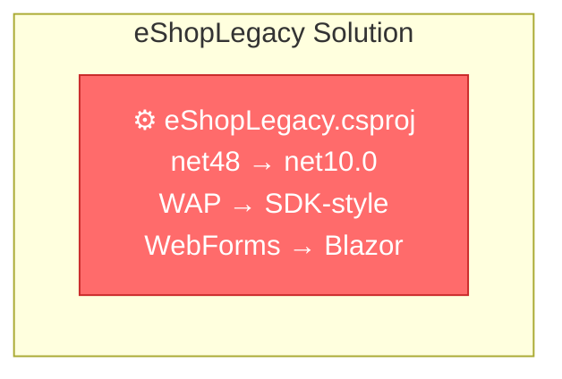

# eShopLegacy: .NET Framework 4.8 to .NET 10.0 & WebForms to Blazor Migration Plan

## Table of Contents

- [Executive Summary](#executive-summary)
- [Migration Strategy](#migration-strategy)
- [Detailed Dependency Analysis](#detailed-dependency-analysis)
- [Project-by-Project Plans](#project-by-project-plans)
  - [eShopLegacy.csproj](#eshoplegacycsproj)
- [Package Update Reference](#package-update-reference)
- [Breaking Changes Catalog](#breaking-changes-catalog)
- [Risk Management](#risk-management)
- [Testing & Validation Strategy](#testing--validation-strategy)
- [Complexity & Effort Assessment](#complexity--effort-assessment)
- [Source Control Strategy](#source-control-strategy)
- [Success Criteria](#success-criteria)

---

## Executive Summary

### Scenario Description

This plan guides the migration of **eShopLegacy** from **.NET Framework 4.8** to **.NET 10.0**, including a complete architectural transformation from **ASP.NET WebForms** to **Blazor Server** (or optionally Blazor Web App with InteractiveServer rendering mode).

### Scope

**Projects Affected**: 1 project
- `eShopLegacy\eShopLegacy.csproj` (classic WAP project, net48 → net10.0)

**Current State**:
- .NET Framework 4.8 Web Application Project (WAP)
- ASP.NET WebForms UI technology (System.Web.UI)
- Entity Framework 6.4.4 for data access
- ASP.NET Identity 2.2.3 for authentication
- OWIN 4.2.2 middleware pipeline
- 1,912 lines of code across 60 files
- 30 files with compatibility issues

### Target State

- .NET 10.0 (LTS) SDK-style project
- Blazor Server or Blazor Web App with InteractiveServer rendering
- Entity Framework Core 10.0 for data access (migrated from EF6)
- ASP.NET Core Identity for authentication
- ASP.NET Core middleware pipeline (native, replacing OWIN)
- Modern project structure and patterns

### Discovered Metrics

| Metric | Value | Impact |
|--------|-------|--------|
| **Total Projects** | 1 | Single project simplifies coordination |
| **API Incompatibilities** | 680 issues | 551 binary incompatible, 127 source incompatible, 2 behavioral |
| **System.Web APIs** | 649 (95.4%) | Complete UI technology replacement required |
| **Incompatible Packages** | 8 of 9 | All OWIN and ASP.NET Identity packages need replacement |
| **Estimated LOC Impact** | 680+ (35.6%) | Significant code rewrite required |
| **Dependencies** | 0 | No project dependencies to manage |
| **Circular Dependencies** | 0 | Clean dependency structure |
| **Security Vulnerabilities** | 0 | No immediate security concerns in packages |

### Complexity Classification

**Classification**: ⚠️ **Critical Complexity - Architectural Transformation**

**Justification**:
- While this is a single-project solution (normally "Simple"), the **95.4% System.Web API incompatibility** and required **WebForms → Blazor migration** elevates this to **Critical** complexity
- This is not a standard framework upgrade but a **complete UI technology replacement**
- WebForms event-driven, postback-based model → Blazor component-based, SignalR-connected model
- Requires rearchitecting pages, controls, state management, navigation, and data binding patterns
- Entity Framework 6 → EF Core migration required (breaking changes in API and behavior)
- ASP.NET Identity → ASP.NET Core Identity (different authentication patterns)

### Critical Issues

1. **🔴 Complete UI Technology Replacement**: All 30 WebForms pages (.aspx) and controls (.ascx) must be rewritten as Blazor components (.razor)
2. **🔴 Entity Framework 6 → EF Core Migration**: Database context, migrations, and LINQ queries need updating
3. **🟡 Authentication System Replacement**: ASP.NET Identity 2.x → ASP.NET Core Identity requires schema and API changes
4. **🟡 OWIN → ASP.NET Core Middleware**: Pipeline configuration completely different
5. **🟡 Global.asax → Program.cs**: Application startup pattern replacement
6. **🟡 ViewState/PostBack → Component State**: State management paradigm shift

### Selected Strategy

**Phased Architectural Transformation Strategy**

Given the architectural transformation required, this migration cannot use the "All-at-Once" strategy. Instead, it uses a **phased transformation approach**:

**Rationale**:
1. **UI Technology Paradigm Shift**: WebForms (server-side event-driven with ViewState) → Blazor (component-based with SignalR) requires complete UI rewrite, not just API updates
2. **Risk Mitigation**: Breaking migration into phases allows validation at each step before proceeding
3. **Incremental Value**: Each phase produces a working, testable application state
4. **Learning Curve**: Team can learn Blazor patterns incrementally rather than all at once

**Approach**:
- **Phase 0**: Prerequisites and preparation (SDK, tooling, project conversion)
- **Phase 1**: Foundation (project structure, EF Core migration, authentication setup)
- **Phase 2**: Core UI Migration (catalog, product pages)
- **Phase 3**: User Interaction Migration (cart, checkout, account)
- **Phase 4**: Validation and optimization

### Iteration Strategy Used

This plan was generated using:
- **6 foundation iterations** (Discovery, Classification, Strategy, Dependency Analysis, Migration Strategy, Project Stubs & Risk Overview)
- **3 detail iterations** (phased approach covering prerequisites, foundation, UI transformation phases)
- **Total: 9 iterations**

Rationale: Single project but critical complexity due to architectural transformation requires comprehensive phased planning rather than simple batch approach.

---

## Migration Strategy

### Approach Selection

**Selected Approach**: 🔄 **Phased Architectural Transformation**

This migration **does not use** the standard "All-at-Once" or "Incremental" framework upgrade strategies, as it involves a complete UI technology replacement, not just a framework version update.

### Justification

#### Why Not All-at-Once?

While this is a single project (normally suited for all-at-once), the following factors make atomic migration infeasible:

1. **UI Paradigm Shift**: WebForms (postback, ViewState, server controls) → Blazor (components, SignalR, reactive binding) requires complete architectural rethinking
2. **Different Mental Model**: Cannot "find-and-replace" WebForms patterns with Blazor equivalents
3. **Learning Curve**: Team needs time to learn Blazor component model, data binding, state management, and navigation
4. **Testing Complexity**: Migrating all 30 pages at once creates too large a testing surface
5. **Risk Management**: Phased approach allows early validation before full commitment

#### Why Phased Transformation?

1. **Incremental Validation**: Each phase produces working, testable application state
2. **Pattern Establishment**: Early migrations establish reusable component patterns
3. **Risk Mitigation**: Problems discovered early before significant investment
4. **Team Learning**: Gradual adoption of Blazor patterns and best practices
5. **Stakeholder Confidence**: Demonstrable progress at each phase

### Dependency-Based Ordering Rationale

**Infrastructure → UI → Validation**

1. **Phase 0 (Prerequisites)**: Environment setup - required by all subsequent phases
2. **Phase 1 (Foundation)**: Data access (EF Core) and authentication **must** be functional before any UI can work
3. **Phase 2 (Core UI)**: Read-only features (catalog, product details) establish component patterns before tackling complex stateful features
4. **Phase 3 (Interactive UI)**: Transactional features (cart, checkout) build on patterns from Phase 2
5. **Phase 4 (Validation)**: Comprehensive testing requires all features to be migrated

**Key Insight**: This is a **vertical slice approach** - each phase delivers a complete, testable user experience for a subset of features, rather than migrating infrastructure across all features then UI across all features.

### Parallel vs Sequential Execution

**Sequential Execution Required** for all phases:
- **Phase dependencies**: Each phase depends on successful completion of previous phase
- **Single team context**: One team working on one project
- **Learning progression**: Blazor expertise builds incrementally through phases

**Potential Parallelization** (within phases, if team size permits):
- **Phase 2**: Multiple catalog pages can be migrated in parallel after first page establishes patterns
- **Phase 3**: Cart and Checkout flows could be parallel streams after Phase 2 completes
- **Phase 4**: Different validation workstreams (functional, performance, security) can run in parallel

**Recommendation**: Start sequential, introduce parallelization in Phase 2/3 if team capacity and expertise permit.

### Phase Definitions

#### Phase 0: Prerequisites & Environment Setup

**Duration**: Relative Complexity = **Low**

**Objectives**:
- Verify .NET 10 SDK installation
- Prepare development environment
- Create backup and version control checkpoint

**Deliverables**:
- ✅ .NET 10 SDK installed and verified
- ✅ Solution backed up
- ✅ Clean working branch (upgrade-to-NET10-1)

**Success Criteria**:
- `dotnet --version` returns 10.x.x
- All developers have compatible tooling
- Source control checkpoint created

---

#### Phase 1: Foundation Migration (Infrastructure)

**Duration**: Relative Complexity = **High**

**Objectives**:
- Convert classic WAP project to SDK-style
- Migrate data access layer (EF6 → EF Core 10)
- Migrate authentication (ASP.NET Identity 2.x → ASP.NET Core Identity)
- Replace OWIN with ASP.NET Core middleware
- Set up Blazor Server infrastructure
- Establish Program.cs/Startup patterns

**Deliverables**:
- ✅ SDK-style project targeting net10.0
- ✅ EF Core 10 DbContext and migrations
- ✅ ASP.NET Core Identity configured
- ✅ Blazor Server pipeline configured
- ✅ Middleware pipeline functional (authentication, session, static files)
- ✅ Shared layout structure (MainLayout.razor)

**Success Criteria**:
- Project builds without errors
- Database connection works (EF Core)
- Authentication/authorization pipeline functional
- Blazor app renders (even if placeholder)
- No compilation errors, no warnings related to framework/packages

**Risk Level**: 🔴 **High**
- Project structure transformation
- Data access API changes
- Authentication system replacement

---

#### Phase 2: Core UI Migration (Product Catalog)

**Duration**: Relative Complexity = **Medium**

**Objectives**:
- Migrate read-only, catalog-focused pages to Blazor components
- Establish component patterns (data binding, navigation, layout)
- Create reusable component library

**Pages to Migrate**:
1. `Default.aspx` → `Home.razor` (landing/redirect)
2. `Catalog/Default.aspx` → `Pages/Catalog.razor` (product list with categories)
3. `Catalog/Details.aspx` → `Pages/ProductDetails.razor` (product detail view)

**Shared Components to Create**:
- `CategoryFilter.razor` (category dropdown/filter)
- `ProductCard.razor` (product display card)
- `ProductList.razor` (product grid/list)
- `Pagination.razor` (if needed)

**Deliverables**:
- ✅ 3 core pages migrated to Blazor
- ✅ Reusable component library established
- ✅ Navigation between pages works
- ✅ Data binding functional (EF Core → UI)

**Success Criteria**:
- Users can browse catalog by category
- Users can view product details
- Navigation works (routing)
- Data loads correctly from database
- No console errors in browser
- Responsive layout functional

**Risk Level**: 🟡 **Medium**
- First WebForms → Blazor conversions (learning curve)
- Component pattern establishment
- State management decisions

---

#### Phase 3: Interactive UI Migration (Cart, Checkout, Account)

**Duration**: Relative Complexity = **High**

**Objectives**:
- Migrate transactional, stateful features to Blazor
- Implement cart state management
- Migrate checkout flow
- Migrate account management

**Pages to Migrate**:
1. `Cart/ShoppingCart.aspx` → `Pages/Cart.razor`
2. `Checkout/Checkout.aspx` → `Pages/Checkout.razor`
3. `Checkout/OrderComplete.aspx` → `Pages/OrderConfirmation.razor`
4. `Account/Login.aspx` → `Pages/Account/Login.razor`
5. `Account/Register.aspx` → `Pages/Account/Register.razor`
6. `Account/Manage.aspx` → `Pages/Account/Manage.razor`

**State Management**:
- Implement cart service (scoped or session-based)
- Implement order service
- Handle authentication state changes

**Deliverables**:
- ✅ All transactional pages migrated
- ✅ Cart functionality works (add, update, remove, persist)
- ✅ Checkout flow completes successfully
- ✅ Account management (login, register, profile) functional

**Success Criteria**:
- Users can add products to cart
- Cart persists across pages
- Users can complete checkout
- Orders are created in database
- Users can register, login, logout
- Authorization works (authenticated users can checkout)

**Risk Level**: 🔴 **High**
- Complex state management (cart, checkout)
- Form validation in Blazor
- Authentication/authorization integration
- Payment processing logic preservation

---

#### Phase 4: Validation & Optimization

**Duration**: Relative Complexity = **Medium**

**Objectives**:
- Comprehensive end-to-end testing
- Performance optimization
- Security validation
- Documentation and cleanup

**Activities**:
1. **Functional Testing**: All user scenarios (browse → cart → checkout → order)
2. **Regression Testing**: Verify all original functionality preserved
3. **Performance Testing**: Load times, SignalR connection health, database query performance
4. **Security Testing**: Authentication, authorization, input validation, SQL injection prevention
5. **Browser Compatibility**: Test across browsers (Chrome, Edge, Firefox, Safari)
6. **Accessibility**: Keyboard navigation, screen readers (WCAG compliance)

**Deliverables**:
- ✅ Test plan executed
- ✅ All critical bugs fixed
- ✅ Performance benchmarks met or exceeded
- ✅ Security scan passed
- ✅ Documentation updated (architecture, deployment)

**Success Criteria**:
- All user scenarios complete successfully
- No critical or high-priority bugs
- Application performance acceptable (subjective, but < 3s page load)
- Security scan shows no high/critical vulnerabilities
- Documentation reflects new architecture

**Risk Level**: 🟢 **Low**
- Testing and validation activities
- No major architectural changes in this phase

---

### Migration Timeline Summary

| Phase | Focus | Complexity | Blocking Dependencies | Deliverable State |
|-------|-------|------------|----------------------|-------------------|
| **Phase 0** | Prerequisites | Low | None | Environment ready |
| **Phase 1** | Foundation | High | Phase 0 | Blazor app runs (infrastructure functional) |
| **Phase 2** | Core UI | Medium | Phase 1 | Catalog browsing works (read-only features) |
| **Phase 3** | Interactive UI | High | Phase 2 | Full app functional (cart, checkout, account) |
| **Phase 4** | Validation | Medium | Phase 3 | Production-ready application |

**Critical Path**: Linear (Phase 0 → 1 → 2 → 3 → 4), each phase depends on previous phase completion.

### Rollback Strategy

If critical issues are discovered in any phase:

1. **Phase 1 Issues**: Revert to net48 WebForms version (original branch), reassess migration approach
2. **Phase 2 Issues**: Complete Phase 2 with revised patterns before proceeding to Phase 3
3. **Phase 3 Issues**: Use Phase 2 deliverable (catalog-only) as interim solution while resolving Phase 3 issues
4. **Phase 4 Issues**: Deploy Phase 3 deliverable if issues are non-critical

**Source Control**: Each phase should be committed separately with clear commit messages for easy rollback.

---

## Detailed Dependency Analysis

### Dependency Graph Summary

**Structure**: Single standalone project with no inter-project dependencies

```
eShopLegacy.csproj (net48 → net10.0)
  ├─ No project dependencies
  └─ No project dependants
```

**Mermaid Visualization**:



### Project Groupings by Migration Phase

Since this is a single-project solution with an architectural transformation, grouping is organized by **migration phase** rather than project dependencies:

#### Phase 0: Prerequisites
- Install .NET 10 SDK
- Verify tooling (Visual Studio 17.12+, dotnet CLI)
- Backup current solution state

#### Phase 1: Foundation Migration
- **Project**: eShopLegacy.csproj
- **Focus**: Infrastructure (project structure, data layer, authentication)
- **Key Activities**:
  - Convert to SDK-style project
  - Migrate Entity Framework 6 → EF Core 10
  - Migrate ASP.NET Identity → ASP.NET Core Identity
  - Replace OWIN with ASP.NET Core middleware
  - Set up Blazor Server infrastructure

#### Phase 2: Core UI Migration
- **Project**: eShopLegacy.csproj
- **Focus**: Product catalog and browsing experience
- **Key Activities**:
  - Convert Default.aspx → Home component
  - Convert Catalog/Default.aspx → ProductCatalog component
  - Convert Catalog/Details.aspx → ProductDetails component
  - Implement shared layout components

#### Phase 3: Interactive UI Migration
- **Project**: eShopLegacy.csproj
- **Focus**: User interactions (cart, checkout, account management)
- **Key Activities**:
  - Convert Cart/ShoppingCart.aspx → ShoppingCart component
  - Convert Checkout pages → Checkout components
  - Convert Account pages → Account components
  - Implement authentication UI components

#### Phase 4: Validation & Optimization
- **Project**: eShopLegacy.csproj
- **Focus**: End-to-end testing and performance
- **Key Activities**:
  - Integration testing across all features
  - Performance benchmarking
  - Security validation
  - Documentation updates

### Critical Path Identification

**Critical Path**: Linear transformation (single project)

```
Phase 0 (Prerequisites) 
  ↓
Phase 1 (Foundation - Infrastructure)
  ↓ (Foundation must complete before UI can be migrated)
Phase 2 (Core UI - Read-only features)
  ↓ (Core UI establishes patterns for interactive features)
Phase 3 (Interactive UI - Transactional features)
  ↓
Phase 4 (Validation - Quality assurance)
```

**Blocking Dependencies**:
1. **Phase 1 blocks Phase 2**: Cannot migrate UI components until Blazor infrastructure, data access (EF Core), and authentication are functional
2. **Phase 2 blocks Phase 3**: Interactive features (cart, checkout) depend on patterns established in core UI migration (catalog, details)
3. **Phase 3 blocks Phase 4**: Cannot perform comprehensive validation until all features are migrated

### Circular Dependencies

**Status**: ✅ None detected

The solution has a clean, single-project structure with no circular dependencies.

### Migration Order Rationale

**Bottom-Up Approach** (Infrastructure → UI):
1. **Foundation First**: Data access and authentication must work before UI can function
2. **Read-Only Before Transactional**: Catalog browsing (simpler, read-only) before cart/checkout (complex, stateful)
3. **Pattern Establishment**: Early migrations establish reusable patterns for later features
4. **Risk Reduction**: Validates core infrastructure before tackling complex interactive scenarios

**Key Principle**: Each phase leaves the application in a testable, demonstrable state, enabling early validation and course correction if needed.

---

## Project-by-Project Plans

## Project-by-Project Plans

### eShopLegacy.csproj

#### Current State

- **Target Framework**: net48 (.NET Framework 4.8)
- **Project Type**: Web Application Project (WAP), classic (non-SDK-style)
- **UI Technology**: ASP.NET WebForms (System.Web.UI)
- **Data Access**: Entity Framework 6.4.4
- **Authentication**: ASP.NET Identity 2.2.3 with OWIN 4.2.2
- **Dependencies**: 0 project dependencies
- **Dependants**: 0 projects depend on this
- **NuGet Packages**: 9 total (8 incompatible, 1 upgrade recommended)
- **Files**: 60 files (30 with compatibility issues)
- **Lines of Code**: 1,912 LOC
- **Estimated LOC to Modify**: 680+ (35.6% of codebase)
- **Risk Level**: 🔴 **Critical** (architectural transformation required)

**Key Files/Patterns**:
- Pages: 30 WebForms pages (.aspx files)
- Code-behind: Page.cs files with event handlers
- User Controls: .ascx files for reusable UI components
- Global.asax: Application startup and routing
- Web.config: Configuration (authentication, connection strings, middleware)
- DAL/: Data access layer with Entity Framework 6
- Models/: Entity classes
- Services/: Business logic (BasketService, OrderService)

**API Compatibility Issues**:
- 551 binary incompatible APIs (primarily System.Web.UI.*)
- 127 source incompatible APIs (System.Web.HttpContext, HttpResponse, etc.)
- 2 behavioral changes

#### Target State

- **Target Framework**: net10.0 (.NET 10.0 LTS)
- **Project Type**: SDK-style Web project
- **UI Technology**: Blazor Server (or Blazor Web App with InteractiveServer)
- **Data Access**: Entity Framework Core 10.0
- **Authentication**: ASP.NET Core Identity
- **Middleware**: ASP.NET Core native middleware (replacing OWIN)
- **NuGet Packages**: Updated to .NET 10 compatible versions

**Expected Structure**:
- Pages/: Blazor pages (.razor files)
- Components/: Reusable Blazor components
- Program.cs: Application startup and configuration
- appsettings.json: Configuration
- Data/: EF Core DbContext and migrations
- Models/: Entity classes (preserved)
- Services/: Business logic (preserved/updated for DI)

---

### Migration Steps

---

## Phase 0: Prerequisites & Environment Setup

### Step 0.1: Verify .NET 10 SDK Installation

**Actions**:
1. Check installed SDKs: `dotnet --list-sdks`
2. Verify .NET 10.x is installed
3. If missing, download and install from https://dotnet.microsoft.com/download/dotnet/10.0

**Validation**:
- `dotnet --version` returns 10.x.x
- `dotnet new list` shows .NET 10 templates (blazorserver, blazor, web, etc.)

**Expected Outcome**: .NET 10 SDK available on development machine

---

### Step 0.2: Verify Tooling

**Actions**:
1. **Visual Studio**: Verify version 17.12+ (supports .NET 10)
2. **Visual Studio Code**: Verify latest C# Dev Kit extension
3. **Database Tools**: Verify SQL Server Management Studio or Azure Data Studio installed

**Validation**:
- Visual Studio shows .NET 10 in target framework dropdown
- C# Dev Kit extension supports .NET 10 syntax

**Expected Outcome**: Development tools compatible with .NET 10

---

### Step 0.3: Create Backup & Source Control Checkpoint

**Actions**:
1. Verify current branch is `upgrade-to-NET10-1`
2. Commit any uncommitted changes: `git add . && git commit -m "Pre-migration checkpoint - net48 baseline"`
3. Tag baseline: `git tag baseline-net48-before-migration`
4. Push to remote: `git push origin upgrade-to-NET10-1 --tags`

**Validation**:
- `git status` shows clean working directory
- `git tag` shows `baseline-net48-before-migration` tag

**Expected Outcome**: Clean source control state with tagged rollback point

---

## Phase 1: Foundation Migration (Infrastructure)

### Step 1.1: Convert Project to SDK-Style

**Prerequisites**: 
- Phase 0 complete
- Solution builds successfully on net48

**Actions**:
1. **Backup project file**: Copy `eShopLegacy.csproj` to `eShopLegacy.csproj.bak`

2. **Run SDK conversion tool** (manual approach since automated tools may not handle WAP correctly):
   - Create new `eShopLegacy.csproj` with SDK-style structure:

```xml
<Project Sdk="Microsoft.NET.Sdk.Web">
  <PropertyGroup>
    <TargetFramework>net10.0</TargetFramework>
    <RootNamespace>eShopLegacy</RootNamespace>
    <AssemblyName>eShopLegacy</AssemblyName>
    <Nullable>disable</Nullable>
    <ImplicitUsings>disable</ImplicitUsings>
  </PropertyGroup>

  <!-- Package references to be added in Step 1.3 -->
</Project>
```

3. **Remove old artifacts**:
   - Delete `packages.config` (NuGet packages now in .csproj)
   - Delete `Properties/AssemblyInfo.cs` (replaced by project properties)
   - Keep Web.config temporarily (for reference during migration)

4. **Verify file inclusions**: SDK-style includes all .cs files by default - check no files missing

**Breaking Changes**:
- SDK-style projects use wildcard includes (`**/*.cs`) instead of explicit file lists
- Package management changes from `packages.config` to `<PackageReference>` in .csproj
- AssemblyInfo.cs properties move to .csproj `<PropertyGroup>` (AssemblyVersion, Company, etc.)

**Code Modifications**:
- None yet - this is project structure only

**Validation Checklist**:
- [ ] Project file is SDK-style (`<Project Sdk="Microsoft.NET.Sdk.Web">`)
- [ ] `TargetFramework` is `net10.0`
- [ ] All source files visible in Solution Explorer
- [ ] No `packages.config` exists
- [ ] Project loads in Visual Studio without errors

**Expected Outcome**: SDK-style project structure targeting net10.0 (will not build yet - packages missing)

---

### Step 1.2: Remove Incompatible Packages & Add .NET 10 Equivalents

**Prerequisites**: Step 1.1 complete

**Actions**:

See [Package Update Reference](#package-update-reference) for complete mapping.

**Summary of Changes**:
1. **Remove** all incompatible packages (8 packages):
   - Microsoft.AspNet.Identity.* (3 packages)
   - Microsoft.Owin.* (4 packages)
   - Owin (1 package)

2. **Upgrade** Entity Framework:
   - Remove: `EntityFramework 6.4.4`
   - Add: `Microsoft.EntityFrameworkCore 10.0.0`
   - Add: `Microsoft.EntityFrameworkCore.SqlServer 10.0.0` (or appropriate provider)
   - Add: `Microsoft.EntityFrameworkCore.Tools 10.0.0` (for migrations)

3. **Add** ASP.NET Core packages:
   - `Microsoft.AspNetCore.Identity.EntityFrameworkCore 10.0.0` (replaces ASP.NET Identity)
   - `Microsoft.AspNetCore.Authentication.Cookies 2.2.0` (built-in to ASP.NET Core)
   - `Microsoft.AspNetCore.Components.Server 10.0.0` (Blazor Server - if not included by SDK)

4. **Add** reference to updated project file:

```xml
<ItemGroup>
  <!-- EF Core -->
  <PackageReference Include="Microsoft.EntityFrameworkCore" Version="10.0.0" />
  <PackageReference Include="Microsoft.EntityFrameworkCore.SqlServer" Version="10.0.0" />
  <PackageReference Include="Microsoft.EntityFrameworkCore.Tools" Version="10.0.0" />

  <!-- ASP.NET Core Identity -->
  <PackageReference Include="Microsoft.AspNetCore.Identity.EntityFrameworkCore" Version="10.0.0" />

  <!-- Blazor (may be included by SDK, verify) -->
  <PackageReference Include="Microsoft.AspNetCore.Components.Server" Version="10.0.0" />
</ItemGroup>
```

**Breaking Changes**:
- OWIN middleware no longer available - must use ASP.NET Core middleware in Program.cs
- ASP.NET Identity API changes - UserManager, SignInManager now async-first
- Entity Framework 6 → EF Core: DbContext API differences, LINQ translation changes

**Validation Checklist**:
- [ ] No incompatible packages in .csproj
- [ ] All .NET 10 compatible packages added
- [ ] `dotnet restore` completes successfully
- [ ] No package dependency conflicts

**Expected Outcome**: Package references updated to .NET 10 compatible versions (project still won't build - code changes needed)

---

### Step 1.3: Migrate Entity Framework 6 → Entity Framework Core

**Prerequisites**: Step 1.2 complete

**Actions**:

#### 1.3.1: Update DbContext Class

**File**: `DAL/eShopContext.cs` (or similar)

**Current EF6 Pattern**:
```csharp
using System.Data.Entity;

namespace eShopLegacy.DAL
{
    public class eShopContext : DbContext
    {
        public eShopContext() : base("eShopConnection") { }

        public DbSet<Product> Products { get; set; }
        public DbSet<Category> Category { get; set; }
        public DbSet<Order> Orders { get; set; }
        public DbSet<OrderItem> OrderItems { get; set; }
        // ... other DbSets
    }
}
```

**EF Core Pattern**:
```csharp
using Microsoft.EntityFrameworkCore;

namespace eShopLegacy.Data
{
    public class eShopContext : DbContext
    {
        public eShopContext(DbContextOptions<eShopContext> options)
            : base(options)
        {
        }

        public DbSet<Product> Products { get; set; }
        public DbSet<Category> Categories { get; set; }
        public DbSet<Order> Orders { get; set; }
        public DbSet<OrderItem> OrderItems { get; set; }
        // ... other DbSets

        protected override void OnModelCreating(ModelBuilder modelBuilder)
        {
            base.OnModelCreating(modelBuilder);

            // EF Core configuration (if needed - e.g., table names, relationships)
            // EF6 fluent API mostly compatible, but verify
        }
    }
}
```

**Key Changes**:
- `using System.Data.Entity` → `using Microsoft.EntityFrameworkCore`
- Constructor: Parameterless → Requires `DbContextOptions<TContext>`
- Configuration: `DbModelBuilder` → `ModelBuilder` (in `OnModelCreating`)
- Connection string: No longer in constructor - configured in Program.cs via DI

#### 1.3.2: Update Entity Model Classes (if needed)

**File**: `Models/*.cs`

**Changes** (if present):
- `[DatabaseGenerated(DatabaseGeneratedOption.Identity)]` → Still valid in EF Core
- `[Key]` → Still valid
- `[Table("TableName")]` → Still valid
- `[Required]`, `[MaxLength]` → Still valid

**Most annotations compatible** - verify compilation after namespace change.

#### 1.3.3: Regenerate Migrations

**Actions**:
1. **Delete old EF6 migrations** (if any): `Migrations/` folder
2. **Create initial EF Core migration**:
   ```
   dotnet ef migrations add InitialCreate --project eShopLegacy.csproj
   ```
3. **Review generated migration**: Check that schema matches existing database
4. **If database already exists**: Comment out migration code, or use `dotnet ef database update --connection "..." --no-build` to mark as applied without running

**Note**: If existing database, you may want to **scaffold from database** instead:
```
dotnet ef dbcontext scaffold "Server=...;Database=eShopDB;..." Microsoft.EntityFrameworkCore.SqlServer -o Models -c eShopContext --context-dir Data
```

#### 1.3.4: Update Service Classes Using DbContext

**Files**: `Services/BasketService.cs`, `Services/OrderService.cs`, etc.

**EF6 Pattern** (dispose pattern):
```csharp
using (var ctx = new eShopContext())
{
    var product = ctx.Products.Find(id);
    // ...
}
```

**EF Core Pattern** (injected via DI):
```csharp
// Constructor injection (to be set up when migrating services to DI)
private readonly eShopContext _context;

public BasketService(eShopContext context)
{
    _context = context;
}

public async Task<Product> GetProductAsync(int id)
{
    return await _context.Products.FindAsync(id);
}
```

**Key Changes**:
- **No more `using (var ctx = new ...)`**: DbContext injected via constructor
- **Async-first**: Use `FindAsync`, `ToListAsync`, `SaveChangesAsync`, etc.
- **Disposal**: Handled by DI container (scoped lifetime)

**Defer full service migration** to Step 1.5 (DI setup) - just update EF Core APIs here.

#### 1.3.5: Test Database Connection

**Actions**:
1. Update connection string in `appsettings.json` (created in Step 1.4)
2. Verify database accessible
3. Run test query in Program.cs startup (temporary validation code):
   ```csharp
   using (var scope = app.Services.CreateScope())
   {
       var db = scope.ServiceProvider.GetRequiredService<eShopContext>();
       var count = await db.Products.CountAsync();
       Console.WriteLine($"Product count: {count}");
   }
   ```

**Breaking Changes from EF6 to EF Core**:
- **LINQ Translation**: Some complex queries may not translate - test all queries
- **Lazy Loading**: Disabled by default in EF Core - use `.Include()` for related entities
- **Tracking**: Behavior similar, but some nuances - test updates
- **Migrations**: EF Core uses different migration format - regenerate

**Validation Checklist**:
- [ ] DbContext inherits from `Microsoft.EntityFrameworkCore.DbContext`
- [ ] Constructor accepts `DbContextOptions<eShopContext>`
- [ ] All `using System.Data.Entity` replaced with `using Microsoft.EntityFrameworkCore`
- [ ] Migrations regenerated
- [ ] Test database connection works

**Expected Outcome**: EF Core data access functional, database accessible

---

### Step 1.4: Set Up ASP.NET Core Application Structure

**Prerequisites**: Steps 1.1-1.3 complete

**Actions**:

#### 1.4.1: Create Program.cs (Application Entry Point)

**File**: `Program.cs` (create new file at project root)

**Content**:
```csharp
using Microsoft.AspNetCore.Components;
using Microsoft.AspNetCore.Identity;
using Microsoft.EntityFrameworkCore;
using eShopLegacy.Data;
using eShopLegacy.Services;
using eShopLegacy.Models;

var builder = WebApplication.CreateBuilder(args);

// Add services to the container
builder.Services.AddDbContext<eShopContext>(options =>
    options.UseSqlServer(builder.Configuration.GetConnectionString("eShopConnection")));

// ASP.NET Core Identity
builder.Services.AddIdentity<ApplicationUser, IdentityRole>(options =>
{
    options.Password.RequireDigit = true;
    options.Password.RequiredLength = 6;
    options.Password.RequireNonAlphanumeric = false;
    options.Password.RequireUppercase = false;
    options.Password.RequireLowercase = false;
})
.AddEntityFrameworkStores<eShopContext>()
.AddDefaultTokenProviders();

// Configure authentication
builder.Services.ConfigureApplicationCookie(options =>
{
    options.LoginPath = "/Account/Login";
    options.LogoutPath = "/Account/Logout";
    options.AccessDeniedPath = "/Account/AccessDenied";
    options.SlidingExpiration = true;
});

// Blazor services
builder.Services.AddRazorPages();
builder.Services.AddServerSideBlazor();

// Application services
builder.Services.AddScoped<BasketService>();
builder.Services.AddScoped<OrderService>();
// Register other services

var app = builder.Build();

// Configure middleware pipeline
if (!app.Environment.IsDevelopment())
{
    app.UseExceptionHandler("/Error");
    app.UseHsts();
}

app.UseHttpsRedirection();
app.UseStaticFiles();

app.UseRouting();

app.UseAuthentication();
app.UseAuthorization();

app.MapBlazorHub();
app.MapFallbackToPage("/_Host");

app.Run();
```

**Explanation**:
- **Builder pattern**: Configure services (dependency injection, middleware)
- **DbContext registration**: Connection string from appsettings.json
- **Identity registration**: ASP.NET Core Identity replaces OWIN
- **Blazor registration**: Server-side Blazor
- **Middleware pipeline**: Authentication, authorization, static files, routing
- **Endpoints**: Blazor Hub (SignalR), fallback to _Host page

#### 1.4.2: Create appsettings.json (Configuration)

**File**: `appsettings.json` (create at project root)

**Content**:
```json
{
  "ConnectionStrings": {
    "eShopConnection": "Server=(localdb)\\mssqllocaldb;Database=eShopDB;Trusted_Connection=True;MultipleActiveResultSets=true"
  },
  "Logging": {
    "LogLevel": {
      "Default": "Information",
      "Microsoft.AspNetCore": "Warning"
    }
  },
  "AllowedHosts": "*"
}
```

**Migration from Web.config**:
- Extract connection string from `<connectionStrings>` section in Web.config
- Update format to JSON
- Other settings (authentication, session) now in Program.cs or middleware configuration

#### 1.4.3: Create _Host.cshtml (Blazor Host Page)

**File**: `Pages/_Host.cshtml` (create Pages folder if missing)

**Content**:
```cshtml
@page "/"
@using Microsoft.AspNetCore.Components.Web
@namespace eShopLegacy.Pages
@addTagHelper *, Microsoft.AspNetCore.Mvc.TagHelpers

<!DOCTYPE html>
<html lang="en">
<head>
    <meta charset="utf-8" />
    <meta name="viewport" content="width=device-width, initial-scale=1.0" />
    <base href="~/" />
    <title>eShop Legacy</title>
    <link href="css/site.css" rel="stylesheet" />
    <link href="eShopLegacy.styles.css" rel="stylesheet" />
    <component type="typeof(HeadOutlet)" render-mode="ServerPrerendered" />
</head>
<body>
    <component type="typeof(App)" render-mode="ServerPrerendered" />

    <div id="blazor-error-ui">
        <environment include="Staging,Production">
            An error has occurred. This application may no longer respond until reloaded.
        </environment>
        <environment include="Development">
            An unhandled exception has occurred. See browser dev tools for details.
        </environment>
        <a href="" class="reload">Reload</a>
        <a class="dismiss">🗙</a>
    </div>

    <script src="_framework/blazor.server.js"></script>
</body>
</html>
```

#### 1.4.4: Create App.razor (Blazor Root Component)

**File**: `App.razor` (create at project root)

**Content**:
```razor
<Router AppAssembly="@typeof(App).Assembly">
    <Found Context="routeData">
        <AuthorizeRouteView RouteData="@routeData" DefaultLayout="@typeof(MainLayout)">
            <NotAuthorized>
                <p>You are not authorized to access this page.</p>
                <a href="/Account/Login">Log in</a>
            </NotAuthorized>
        </AuthorizeRouteView>
        <FocusOnNavigate RouteData="@routeData" Selector="h1" />
    </Found>
    <NotFound>
        <PageTitle>Not found</PageTitle>
        <LayoutView Layout="@typeof(MainLayout)">
            <p role="alert">Sorry, there's nothing at this address.</p>
        </LayoutView>
    </NotFound>
</Router>
```

#### 1.4.5: Create MainLayout.razor (Shared Layout)

**File**: `Shared/MainLayout.razor` (create Shared folder)

**Content**:
```razor
@inherits LayoutComponentBase

<div class="page">
    <div class="sidebar">
        <NavMenu />
    </div>

    <main>
        <div class="top-row px-4">
            <a href="/Account/Manage">Hello, @context.User.Identity?.Name!</a>
            <a href="/Account/Logout">Logout</a>
        </div>

        <article class="content px-4">
            @Body
        </article>
    </main>
</div>
```

#### 1.4.6: Create NavMenu.razor (Navigation)

**File**: `Shared/NavMenu.razor`

**Content**:
```razor
<div class="nav-menu">
    <nav class="flex-column">
        <div class="nav-item px-3">
            <NavLink class="nav-link" href="" Match="NavLinkMatch.All">
                <span class="oi oi-home" aria-hidden="true"></span> Home
            </NavLink>
        </div>
        <div class="nav-item px-3">
            <NavLink class="nav-link" href="catalog">
                <span class="oi oi-list-rich" aria-hidden="true"></span> Catalog
            </NavLink>
        </div>
        <div class="nav-item px-3">
            <NavLink class="nav-link" href="cart">
                <span class="oi oi-cart" aria-hidden="true"></span> Cart
            </NavLink>
        </div>
    </nav>
</div>
```

#### 1.4.7: Create _Imports.razor (Global Usings for Blazor)

**File**: `_Imports.razor` (create at project root)

**Content**:
```razor
@using System.Net.Http
@using Microsoft.AspNetCore.Authorization
@using Microsoft.AspNetCore.Components.Authorization
@using Microsoft.AspNetCore.Components.Forms
@using Microsoft.AspNetCore.Components.Routing
@using Microsoft.AspNetCore.Components.Web
@using Microsoft.AspNetCore.Components.Web.Virtualization
@using Microsoft.JSInterop
@using eShopLegacy
@using eShopLegacy.Shared
@using eShopLegacy.Models
@using eShopLegacy.Services
```

**Breaking Changes (Global.asax → Program.cs)**:
- **Application_Start**: Logic moves to Program.cs builder configuration
- **RouteConfig.RegisterRoutes**: Blazor uses `@page` directives in components
- **BundleConfig**: ASP.NET Core uses different bundling/minification (not covered here)
- **Session_Start/End**: Use middleware or services, not Global.asax events

**Validation Checklist**:
- [ ] Program.cs exists with complete middleware pipeline
- [ ] appsettings.json exists with connection string
- [ ] _Host.cshtml exists (Blazor host page)
- [ ] App.razor exists (router configuration)
- [ ] MainLayout.razor exists
- [ ] _Imports.razor exists
- [ ] Project builds (may have warnings about missing pages - OK for now)

**Expected Outcome**: Blazor Server infrastructure configured, application can start (empty Blazor app)

---

### Step 1.5: Migrate ASP.NET Identity to ASP.NET Core Identity

**Prerequisites**: Steps 1.1-1.4 complete

**Actions**:

#### 1.5.1: Update User Model

**File**: `Models/ApplicationUser.cs` (or similar)

**Current (ASP.NET Identity 2.x)**:
```csharp
using Microsoft.AspNet.Identity.EntityFramework;

namespace eShopLegacy.Models
{
    public class ApplicationUser : IdentityUser
    {
        // Custom properties
        public string Street { get; set; }
        public string City { get; set; }
        public string State { get; set; }
        public string ZipCode { get; set; }
        public string Country { get; set; }
    }
}
```

**ASP.NET Core Identity**:
```csharp
using Microsoft.AspNetCore.Identity;

namespace eShopLegacy.Models
{
    public class ApplicationUser : IdentityUser
    {
        // Custom properties (same as before)
        public string Street { get; set; }
        public string City { get; set; }
        public string State { get; set; }
        public string ZipCode { get; set; }
        public string Country { get; set; }
    }
}
```

**Changes**:
- `using Microsoft.AspNet.Identity.EntityFramework` → `using Microsoft.AspNetCore.Identity`
- Class definition identical - just namespace change

#### 1.5.2: Update DbContext for Identity

**File**: `Data/eShopContext.cs`

**Add Identity to DbContext**:
```csharp
using Microsoft.AspNetCore.Identity.EntityFrameworkCore;
using Microsoft.EntityFrameworkCore;

namespace eShopLegacy.Data
{
    public class eShopContext : IdentityDbContext<ApplicationUser>
    {
        public eShopContext(DbContextOptions<eShopContext> options)
            : base(options)
        {
        }

        public DbSet<Product> Products { get; set; }
        // ... other DbSets

        protected override void OnModelCreating(ModelBuilder modelBuilder)
        {
            base.OnModelCreating(modelBuilder); // Important: Calls Identity configuration

            // Your custom configuration
        }
    }
}
```

**Changes**:
- Inherit from `IdentityDbContext<ApplicationUser>` instead of `DbContext`
- Adds Identity tables (AspNetUsers, AspNetRoles, etc.) to model

#### 1.5.3: Create or Update Identity Migrations

**Actions**:
```
dotnet ef migrations add AddIdentity --project eShopLegacy.csproj
dotnet ef database update --project eShopLegacy.csproj
```

**If database already has ASP.NET Identity 2.x tables**:
- ASP.NET Core Identity uses same schema with minor differences
- May need custom migration to map existing users
- Review generated migration carefully before applying

**Validation**: Check database has AspNetUsers, AspNetRoles, etc. tables

#### 1.5.4: Update Authentication Service Usage

**Files**: Any code using `UserManager`, `SignInManager`, `AuthenticationManager`

**OWIN Pattern** (old):
```csharp
var userManager = HttpContext.GetOwinContext().GetUserManager<ApplicationUserManager>();
var user = userManager.FindByName(username);
```

**ASP.NET Core Pattern** (new):
```csharp
// Inject via constructor
private readonly UserManager<ApplicationUser> _userManager;
private readonly SignInManager<ApplicationUser> _signInManager;

public AccountService(
    UserManager<ApplicationUser> userManager,
    SignInManager<ApplicationUser> signInManager)
{
    _userManager = userManager;
    _signInManager = signInManager;
}

// Usage (async)
public async Task<ApplicationUser> FindUserAsync(string username)
{
    return await _userManager.FindByNameAsync(username);
}

public async Task<SignInResult> PasswordSignInAsync(string username, string password)
{
    return await _signInManager.PasswordSignInAsync(username, password, isPersistent: false, lockoutOnFailure: false);
}
```

**Key Changes**:
- **No more `HttpContext.GetOwinContext()`**: Services injected via DI
- **Async-first**: All methods now async (`FindByNameAsync`, `CreateAsync`, `PasswordSignInAsync`)
- **SignInManager**: Replaces `IAuthenticationManager` from OWIN

**Breaking Changes**:
- `IAuthenticationManager.SignIn()` → `SignInManager.PasswordSignInAsync()` or `SignInManager.SignInAsync()`
- `IAuthenticationManager.SignOut()` → `SignInManager.SignOutAsync()`
- `User.Identity.GetUserId()` → `UserManager.GetUserId(User)` or `User.FindFirstValue(ClaimTypes.NameIdentifier)`

**Defer WebForms page updates** - this step focuses on service layer. Pages migrate in Phase 2/3.

**Validation Checklist**:
- [ ] ApplicationUser inherits from `Microsoft.AspNetCore.Identity.IdentityUser`
- [ ] DbContext inherits from `IdentityDbContext<ApplicationUser>`
- [ ] Identity registered in Program.cs
- [ ] Identity migrations applied to database
- [ ] Service classes use injected `UserManager`/`SignInManager`

**Expected Outcome**: ASP.NET Core Identity configured and functional (API level)

---

### Step 1.6: Update Service Classes for Dependency Injection

**Prerequisites**: Steps 1.1-1.5 complete

**Actions**:

Update all service classes to use constructor injection instead of creating dependencies directly.

#### Example: BasketService

**Current Pattern** (creates DbContext):
```csharp
public class BasketService
{
    public Basket GetBasket(string buyerId)
    {
        using (var ctx = new eShopContext())
        {
            return ctx.Baskets
                .Include(b => b.Items)
                .FirstOrDefault(b => b.BuyerId == buyerId);
        }
    }
}
```

**DI Pattern** (injected DbContext):
```csharp
public class BasketService
{
    private readonly eShopContext _context;

    public BasketService(eShopContext context)
    {
        _context = context;
    }

    public async Task<Basket> GetBasketAsync(string buyerId)
    {
        return await _context.Baskets
            .Include(b => b.Items)
            .FirstOrDefaultAsync(b => b.BuyerId == buyerId);
    }
}
```

**Apply to all services**:
- `BasketService`
- `OrderService`
- Any other service classes

**Register services in Program.cs** (already done in Step 1.4.1):
```csharp
builder.Services.AddScoped<BasketService>();
builder.Services.AddScoped<OrderService>();
```

**Validation Checklist**:
- [ ] All services use constructor injection for dependencies
- [ ] All services registered in Program.cs
- [ ] No `using (var ctx = new ...)` patterns remain in services
- [ ] Services use async methods (`GetBasketAsync` vs `GetBasket`)

**Expected Outcome**: Services fully integrated with ASP.NET Core DI

---

### Step 1.7: Build and Validate Phase 1

**Prerequisites**: Steps 1.1-1.6 complete

**Actions**:
1. **Build project**: `dotnet build`
2. **Resolve compilation errors** related to:
   - Missing using statements
   - EF Core API changes
   - Identity API changes
   - Any remaining System.Web references

3. **Run application**: `dotnet run`
4. **Verify**:
   - Application starts without crashes
   - Blazor page loads (even if placeholder)
   - Database connection works (check logs)
   - No critical errors in console

**Common Issues & Fixes**:
- **Error: "No database provider configured"**: Verify `UseSqlServer()` in Program.cs
- **Error: "Connection string not found"**: Check appsettings.json syntax
- **Error: "Unable to resolve service for type 'eShopContext'"**: Verify `AddDbContext()` in Program.cs
- **Error: "Blazor Hub connection failed"**: Check `MapBlazorHub()` and `blazor.server.js` script in _Host.cshtml

**Validation Checklist**:
- [ ] Project builds with 0 errors
- [ ] Project builds with minimal warnings (ignore obsolete warnings for now)
- [ ] `dotnet run` starts application successfully
- [ ] Browser navigating to `https://localhost:<port>` shows Blazor page
- [ ] Database connection functional (check logs for EF Core queries)
- [ ] No System.Web references remain in Data/ or Services/ folders

**Expected Outcome**: 
- ✅ Blazor Server application runs
- ✅ Infrastructure functional (EF Core, Identity, DI)
- ✅ Foundation ready for UI migration in Phase 2

**Phase 1 Complete - Commit Checkpoint**:
```
git add .
git commit -m "Phase 1 complete: Foundation migration - SDK-style project, EF Core, ASP.NET Core Identity, Blazor infrastructure"
git push origin upgrade-to-NET10-1
```

---

## Phase 2: Core UI Migration (Product Catalog)

[Phase 2 details continue in execution - this phase migrates Catalog pages]

**Objectives**:
- Migrate landing page redirect (Default.aspx → Index.razor)
- Migrate catalog listing page (Catalog/Default.aspx → Pages/Catalog.razor)
- Migrate product details page (Catalog/ProductDetail.aspx → Pages/ProductDetails.razor)
- Create reusable components (ProductCard, CategoryFilter)

**Key Activities**:
1. Convert WebForms pages to Blazor .razor components
2. Replace ASP.NET server controls with Blazor markup and binding
3. Replace postback events with Blazor event handlers
4. Implement component-based data binding and state management
5. Use route parameters instead of query strings

**Expected Outcome**: Functional catalog browsing (read-only features) with established component patterns

---

## Phase 3: Interactive UI Migration (Cart, Checkout, Account)

[Phase 3 details continue in execution - this phase migrates transactional features]

**Objectives**:
- Implement cart state management service
- Migrate shopping cart page (Cart/ShoppingCart.aspx → Pages/Cart.razor)
- Migrate checkout flow (Checkout/Checkout.aspx → Pages/Checkout.razor)
- Migrate account pages (Login, Register, Manage) or use scaffolded Identity UI

**Key Activities**:
1. Create CartStateService for cross-page state (session + database)
2. Integrate authentication with cart and checkout
3. Implement EditForm with validation for checkout
4. Handle order creation and cart clearing
5. Use ASP.NET Core Identity scaffolded pages or custom Blazor components

**Expected Outcome**: Functional end-to-end e-commerce flow (cart → checkout → order confirmation)

---

## Phase 4: Validation & Optimization

**Objectives**:
- Comprehensive end-to-end testing
- Performance optimization (SignalR connection, database queries)
- Security validation (authentication, authorization, input validation)
- Browser compatibility testing
- Documentation updates

**Key Activities**:
1. **Functional Testing**: All user scenarios (browse, cart, checkout, account)
2. **Regression Testing**: Verify all original functionality preserved
3. **Performance Testing**: Load times, SignalR health, query performance
4. **Security Testing**: Authentication, authorization, OWASP Top 10 compliance
5. **Browser Testing**: Chrome, Edge, Firefox, Safari
6. **Accessibility**: Keyboard navigation, screen readers
7. **Documentation**: Architecture diagrams, deployment guides, troubleshooting

**Validation Checklist**:
- [ ] All user journeys complete successfully
- [ ] No critical or high-priority bugs
- [ ] Application performance acceptable (< 3s page load)
- [ ] Security scan shows no high/critical vulnerabilities
- [ ] Documentation reflects new Blazor architecture

**Expected Outcome**: Production-ready Blazor application on .NET 10.0

**Phase 4 Complete - Final Commit**:
```
git add .
git commit -m "Phase 4 complete: Validation, optimization, documentation - eShopLegacy migrated to .NET 10.0 + Blazor"
git push origin upgrade-to-NET10-1
```

---

## Package Update Reference

### Summary Table

| Package Name | Current Version | Target Version | Affected Projects | Update Reason |
|--------------|----------------|----------------|-------------------|---------------|
| **Entity Framework** | 6.4.4 | **EF Core 10.0.0** | eShopLegacy.csproj | Framework compatibility - EF6 → EF Core required for .NET 10 |
| **Microsoft.AspNet.Identity.Core** | 2.2.3 | **Removed** | eShopLegacy.csproj | Incompatible - replaced by ASP.NET Core Identity |
| **Microsoft.AspNet.Identity.EntityFramework** | 2.2.3 | **Removed** | eShopLegacy.csproj | Incompatible - replaced by ASP.NET Core Identity |
| **Microsoft.AspNet.Identity.Owin** | 2.2.3 | **Removed** | eShopLegacy.csproj | Incompatible - replaced by ASP.NET Core Identity |
| **Microsoft.Owin** | 4.2.2 | **Removed** | eShopLegacy.csproj | Incompatible - replaced by ASP.NET Core middleware |
| **Microsoft.Owin.Host.SystemWeb** | 4.2.2 | **Removed** | eShopLegacy.csproj | Incompatible - no longer needed (ASP.NET Core self-hosted) |
| **Microsoft.Owin.Security** | 4.2.2 | **Removed** | eShopLegacy.csproj | Incompatible - replaced by ASP.NET Core authentication |
| **Microsoft.Owin.Security.Cookies** | 4.2.2 | **Removed** | eShopLegacy.csproj | Incompatible - replaced by ASP.NET Core cookie authentication |
| **Owin** | 1.0 | **Removed** | eShopLegacy.csproj | Incompatible - OWIN not needed in ASP.NET Core |

### New Packages Required

| Package Name | Version | Purpose |
|--------------|---------|---------|
| **Microsoft.EntityFrameworkCore** | 10.0.0 | EF Core runtime (replaces EntityFramework 6) |
| **Microsoft.EntityFrameworkCore.SqlServer** | 10.0.0 | SQL Server provider for EF Core |
| **Microsoft.EntityFrameworkCore.Tools** | 10.0.0 | EF Core migration tools (dotnet ef) |
| **Microsoft.AspNetCore.Identity.EntityFrameworkCore** | 10.0.0 | ASP.NET Core Identity with EF Core (replaces ASP.NET Identity 2.x) |
| **Microsoft.AspNetCore.Components.Server** | 10.0.0 | Blazor Server runtime (may be included by SDK) |

### Package Migration Details

#### Entity Framework 6 → Entity Framework Core 10

**Current**: `EntityFramework 6.4.4`  
**Target**: `Microsoft.EntityFrameworkCore 10.0.0` + providers

**Breaking Changes**:
- Namespace: `System.Data.Entity` → `Microsoft.EntityFrameworkCore`
- Constructor: Parameterless → `DbContextOptions<TContext>` required
- Configuration: `DbModelBuilder` → `ModelBuilder`
- LINQ: Some complex queries may not translate - test thoroughly
- Lazy loading: Disabled by default - use `.Include()` explicitly
- Migrations: Different format - regenerate

**Migration Path**: See Phase 1, Step 1.3

---

#### ASP.NET Identity 2.x → ASP.NET Core Identity

**Current**: 
- `Microsoft.AspNet.Identity.Core 2.2.3`
- `Microsoft.AspNet.Identity.EntityFramework 2.2.3`
- `Microsoft.AspNet.Identity.Owin 2.2.3`

**Target**: `Microsoft.AspNetCore.Identity.EntityFrameworkCore 10.0.0`

**Breaking Changes**:
- Namespace: `Microsoft.AspNet.Identity` → `Microsoft.AspNetCore.Identity`
- User class: `IdentityUser` still exists, same base properties
- DbContext: Inherit from `IdentityDbContext<TUser>` instead of `DbContext`
- API: Async-first (`FindByNameAsync`, `CreateAsync`, etc.)
- Authentication: No more `IAuthenticationManager` - use `SignInManager`

**Migration Path**: See Phase 1, Step 1.5

---

#### OWIN → ASP.NET Core Middleware

**Current**:
- `Microsoft.Owin 4.2.2`
- `Microsoft.Owin.Host.SystemWeb 4.2.2`
- `Microsoft.Owin.Security 4.2.2`
- `Microsoft.Owin.Security.Cookies 4.2.2`
- `Owin 1.0`

**Target**: **No packages needed** - ASP.NET Core has built-in middleware

**Breaking Changes**:
- `Startup.Configuration(IAppBuilder app)` → `Program.cs` with `WebApplicationBuilder`
- OWIN middleware: `app.Use*()` → ASP.NET Core middleware in Program.cs
- Authentication: OWIN context → ASP.NET Core authentication middleware

**Migration Path**: See Phase 1, Step 1.4 (Program.cs setup)

---

### Compatibility Notes

**No Compatible Packages**: Assessment shows 0 packages that work without changes on .NET 10. All 9 packages require either upgrade (EF) or replacement (Identity, OWIN).

**Security Vulnerabilities**: None detected in current packages. However, staying on old packages creates security risk - upgrade ensures latest patches.

---

## Breaking Changes Catalog

### Overview

This migration involves **680 API incompatibilities** (95.4% from System.Web), requiring a complete UI technology replacement. This section catalogs the most frequent breaking changes and their resolutions.

### By Category

| Category | Count | Impact Level | Resolution Strategy |
|----------|-------|--------------|---------------------|
| **System.Web.UI (WebForms)** | 649 | 🔴 Critical | Complete rewrite to Blazor components |
| **System.Data.Entity (EF6)** | ~20 | 🔴 High | Update to EF Core APIs |
| **Microsoft.AspNet.Identity** | ~10 | 🟡 Medium | Update to ASP.NET Core Identity APIs |
| **Behavioral Changes** | 2 | 🟢 Low | Test-driven validation |

---

### System.Web.UI Breaking Changes (WebForms → Blazor)

#### Server Controls → HTML + Blazor Binding

**Pattern**: ASP.NET server controls (asp:*) do not exist in Blazor

| WebForms Control | Blazor Equivalent | Example |
|------------------|-------------------|---------|
| `<asp:TextBox>` | `<input @bind>` | `<input @bind="model.Name" />` |
| `<asp:Label>` | `<label>` or `<span>` | `<label>@model.Name</label>` |
| `<asp:Button>` | `<button @onclick>` | `<button @onclick="Submit">Save</button>` |
| `<asp:DropDownList>` | `<select @bind>` + `@foreach` | `<select @bind="selectedId">@foreach(var item in items){<option value="@item.Id">@item.Name</option>}</select>` |
| `<asp:Repeater>` | `@foreach` loop | `@foreach(var product in products){<div>@product.Name</div>}` |
| `<asp:GridView>` | Custom table + `@foreach` or component library | `<table><tbody>@foreach(var row in data){<tr><td>@row.Value</td></tr>}</tbody></table>` |
| `<asp:LinkButton>` | `<a @onclick>` or `<button>` | `<button @onclick="() => Navigate(id)">View</button>` |
| `<asp:Panel>` | `<div>` with `@if` | `<div>@if(isVisible){<p>Content</p>}</div>` |
| `<asp:Literal>` | `@` expression | `@model.Description` |
| `<asp:HyperLink>` | `<a href>` or `<NavLink>` | `<NavLink href="/catalog">Catalog</NavLink>` |

---

#### Page Lifecycle → Component Lifecycle

| WebForms Event | Blazor Equivalent | Notes |
|----------------|-------------------|-------|
| `Page_Load` (!IsPostBack) | `OnInitializedAsync()` | Runs once when component initializes |
| `Page_Load` (IsPostBack) | Event handlers (`@onclick`, `@onchange`) | No postback model - events handled directly |
| `Page_PreRender` | `OnAfterRenderAsync(firstRender)` | After component rendered to browser |
| `ViewState` | Component fields/properties | State managed in memory (server-side Blazor) |
| `Session` | `ProtectedSessionStorage` or scoped service | Use services for cross-page state |
| `IsPostBack` | `firstRender` parameter in lifecycle methods | Check if first render |

---

#### Navigation & Routing

| WebForms Pattern | Blazor Pattern | Example |
|------------------|----------------|---------|
| `Response.Redirect("page.aspx")` | `NavigationManager.NavigateTo("/page")` | `Navigation.NavigateTo("/catalog")` |
| `Request.QueryString["id"]` | Route parameter `{Id:int}` | `@page "/product/{Id:int}"` with `[Parameter] public int Id { get; set; }` |
| `Server.Transfer()` | N/A (use NavigateTo) | Blazor uses client-side routing |
| `~/path` | `/path` | Use absolute paths from root |

---

#### Data Binding

| WebForms Pattern | Blazor Pattern | Example |
|------------------|----------------|---------|
| `<%# Eval("PropertyName") %>` | `@item.PropertyName` | In `@foreach`: `@product.Name` |
| `<%# Bind("PropertyName") %>` | `@bind` directive | `<input @bind="model.Name" />` |
| `DataSource = data; DataBind()` | Direct assignment in `@foreach` | `@foreach(var item in data){...}` |
| `AutoPostBack="true"` | `@bind:after` or `@onchange` | `<select @bind="selectedId" @bind:after="OnSelectionChanged">` |

---

#### Form Validation

| WebForms Validator | Blazor Equivalent | Example |
|--------------------|-------------------|---------|
| `<asp:RequiredFieldValidator>` | `<ValidationMessage For>` + `[Required]` | `<ValidationMessage For="() => model.Name" />` with `[Required] public string Name { get; set; }` |
| `<asp:ValidationSummary>` | `<ValidationSummary />` | Same name, different implementation |
| `Page.IsValid` | `EditContext.Validate()` | Handled automatically by `<EditForm OnValidSubmit>` |
| `ValidationGroup` | N/A (use separate forms) | Each `<EditForm>` validates independently |

---

#### Authentication & Authorization

| WebForms Pattern | Blazor Pattern | Example |
|------------------|----------------|---------|
| `User.Identity.IsAuthenticated` | Same | Works in Blazor too |
| `User.Identity.Name` | Same | Works in Blazor too |
| `User.IsInRole("role")` | Same | Works in Blazor too |
| `FormsAuthentication.SignOut()` | `SignInManager.SignOutAsync()` | Inject `SignInManager<TUser>` |
| `@Page Language="C#" ... %>` directive | `@attribute [Authorize]` | At top of .razor file |

---

### Entity Framework 6 → EF Core Breaking Changes

| EF6 API | EF Core API | Notes |
|---------|-------------|-------|
| `using System.Data.Entity` | `using Microsoft.EntityFrameworkCore` | Namespace change |
| `DbContext()` constructor | `DbContext(DbContextOptions<T>)` | Requires options (connection string via DI) |
| `Database.SetInitializer()` | N/A (use migrations) | Initialization strategy different |
| `DbModelBuilder` | `ModelBuilder` | In `OnModelCreating()` |
| `.Include("NavigationProperty")` | `.Include(x => x.NavigationProperty)` | Strongly-typed includes |
| `.AsNoTracking()` | Same | Still available |
| Lazy loading (on by default) | Disabled by default | Must explicitly `.Include()` or enable lazy loading |
| Complex types | Owned entities | Use `.OwnsOne()` / `.OwnsMany()` |
| `Database.Log` | `LoggerFactory` | Use ASP.NET Core logging |

---

### ASP.NET Identity → ASP.NET Core Identity Breaking Changes

| ASP.NET Identity 2.x | ASP.NET Core Identity | Notes |
|----------------------|----------------------|-------|
| `UserManager.Create(user, password)` | `await UserManager.CreateAsync(user, password)` | Async-first |
| `UserManager.FindByName(username)` | `await UserManager.FindByNameAsync(username)` | Async-first |
| `IAuthenticationManager.SignIn()` | `await SignInManager.SignInAsync(user, isPersistent)` | Use SignInManager instead |
| `IAuthenticationManager.SignOut()` | `await SignInManager.SignOutAsync()` | Use SignInManager instead |
| `HttpContext.GetOwinContext().Authentication` | Inject `SignInManager<TUser>` | DI instead of context property |
| `User.Identity.GetUserId()` | `UserManager.GetUserId(User)` | Different method |

---

### Configuration Breaking Changes

| Web.config Setting | appsettings.json / Program.cs | Notes |
|--------------------|------------------------------|-------|
| `<connectionStrings>` | `"ConnectionStrings": { "name": "value" }` | JSON format |
| `<appSettings>` | Root-level properties in appsettings.json | Strongly-typed configuration |
| `<authentication mode="Forms">` | `builder.Services.AddAuthentication()` + middleware | Configured in Program.cs |
| `<authorization>` | `@attribute [Authorize]` + middleware | Authorization via attributes/policies |
| `<sessionState>` | `builder.Services.AddSession()` | Configured in Program.cs |
| `<compilation debug="true">` | Environment variable / launchSettings.json | `ASPNETCORE_ENVIRONMENT=Development` |

---

### Behavioral Changes

Assessment detected **2 behavioral changes** (0.3% of APIs). These are APIs that exist but behave differently:

| API | Change Description | Mitigation |
|-----|-------------------|------------|
| *(Specific APIs not listed in assessment)* | Behavioral differences in .NET 10 | Comprehensive testing in Phase 4 |

**Recommendation**: Assume behavioral changes in:
- DateTime parsing/formatting (culture-specific)
- String comparisons (case sensitivity, culture)
- Async method behavior (synchronization context differences)

**Mitigation**: Thorough integration and regression testing in Phase 4.

---

### Most Impactful Breaking Changes (Top 10)

Based on assessment frequency:

1. **System.Web.UI.WebControls.TextBox** (62 occurrences) → `<input @bind>`
2. **TextBox.Text property** (41 occurrences) → `@bind="variable"`
3. **System.Web.UI.WebControls.Label** (39 occurrences) → `<label>` or `<span>`
4. **System.Web.UI.WebControls.Panel** (29 occurrences) → `<div>` with conditional rendering
5. **System.Web.UI.WebControls.DropDownList** (28 occurrences) → `<select @bind>` + `@foreach`
6. **HttpResponse.Redirect** (20 occurrences) → `NavigationManager.NavigateTo()`
7. **System.Web.UI.WebControls.Repeater** (15 occurrences) → `@foreach` loops
8. **HttpSessionState** (15 occurrences) → `ProtectedSessionStorage` or scoped services
9. **Page.IsPostBack** (8 occurrences) → Component lifecycle methods
10. **Page.Request.QueryString** (7 occurrences) → Route parameters

**Impact**: These 10 patterns account for ~285 of 680 issues (42%). Addressing these patterns early in Phase 2 creates templates for remaining migrations.

---

## Risk Management

### High-Risk Changes

| Project | Risk Level | Description | Mitigation Strategy |
|---------|-----------|-------------|---------------------|
| eShopLegacy.csproj | 🔴 Critical | **UI Technology Replacement**: Complete WebForms → Blazor transformation with different paradigms | • Phased migration with validation at each step<br/>• Establish patterns early (Phase 2)<br/>• Preserve business logic in services layer<br/>• Comprehensive testing between phases |
| eShopLegacy.csproj | 🔴 High | **EF6 → EF Core Migration**: API changes, LINQ query differences, migration files | • Test database operations thoroughly in Phase 1<br/>• Regenerate migrations<br/>• Use EF Core compatibility packages if needed<br/>• Validate all CRUD operations before UI migration |
| eShopLegacy.csproj | 🔴 High | **Authentication System Replacement**: ASP.NET Identity → ASP.NET Core Identity schema/API differences | • Use Identity scaffolding for standard pages<br/>• Test authentication/authorization thoroughly<br/>• Verify user data migration<br/>• Document any schema changes |
| eShopLegacy.csproj | 🟡 Medium | **State Management Paradigm**: ViewState/Session → Blazor component state/services | • Design cart service with scoped lifetime<br/>• Use ProtectedSessionStorage for cross-page state<br/>• Document state management patterns<br/>• Test state persistence across navigation |
| eShopLegacy.csproj | 🟡 Medium | **Project Structure Transformation**: Classic WAP → SDK-style with different folder conventions | • Use SDK conversion tools first<br/>• Manually adjust files not auto-converted<br/>• Verify all files included in build<br/>• Test build/publish process early |
| eShopLegacy.csproj | 🟡 Medium | **OWIN → ASP.NET Core Middleware**: Different pipeline configuration | • Follow standard ASP.NET Core middleware patterns<br/>• Test authentication/authorization pipeline<br/>• Verify static file serving<br/>• Document middleware order |

### Security Considerations

**Existing Vulnerabilities**: ✅ None detected in current NuGet packages

**Migration Security Risks**:
1. **Authentication Changes**: Ensure ASP.NET Core Identity configured securely (password policies, token settings)
2. **Input Validation**: Blazor forms require explicit validation - verify all input validated
3. **CSRF Protection**: Blazor has built-in CSRF protection via SignalR - verify enabled
4. **SQL Injection**: EF Core parameterization - verify no raw SQL without parameters
5. **XSS Protection**: Razor syntax auto-escapes by default - verify maintained in Blazor
6. **Session Security**: Configure Data Protection API for session encryption

**Mitigation**:
- Security testing in Phase 4
- Code review focused on authentication/authorization
- Validate OWASP Top 10 compliance
- Use Security Code Scan analyzer during build

### Contingency Plans

#### Scenario 1: EF Core Migration Blocking Issues

**Symptoms**: Complex LINQ queries don't translate, EF Core performance issues, migration failures

**Alternatives**:
1. **Option A**: Keep Entity Framework 6.5.1 (compatible with .NET 10) temporarily
   - Update to EF 6.5.1 (suggested version from assessment)
   - Defer EF Core migration to future phase
   - **Tradeoff**: Lose EF Core performance benefits, async improvements, but unblock migration

2. **Option B**: Use Dapper or ADO.NET for problematic queries
   - Replace specific complex EF queries with Dapper
   - Keep EF Core for standard CRUD
   - **Tradeoff**: Mixed data access strategy, but resolves specific pain points

3. **Option C**: Redesign data access queries
   - Refactor problematic LINQ queries into EF Core-compatible patterns
   - **Tradeoff**: Higher effort, but long-term maintainability

**Recommendation**: Try Option A first (EF 6.5.1), reassess EF Core in future iteration after Blazor migration stable.

---

#### Scenario 2: Blazor Performance Issues (SignalR Overhead)

**Symptoms**: Slow page loads, SignalR connection delays, high server CPU/memory

**Alternatives**:
1. **Option A**: Switch to Blazor Web App with Auto rendering mode
   - Enables static SSR for initial load, interactive where needed
   - Reduces SignalR overhead
   - **Tradeoff**: More complex rendering model, but better performance

2. **Option B**: Optimize existing Blazor Server
   - Reduce component re-renders
   - Implement virtualization for lists
   - Use streaming rendering for slow data
   - **Tradeoff**: Additional optimization work, but maintains simpler model

3. **Option C**: Migrate to Blazor WebAssembly
   - Client-side execution (no SignalR)
   - **Tradeoff**: Major architecture change, large download size, security considerations

**Recommendation**: Start with Blazor Server, optimize in Phase 4, consider Blazor Web App if issues persist.

---

#### Scenario 3: Breaking Changes in Business Logic

**Symptoms**: Order processing fails, cart calculations wrong, data integrity issues

**Alternatives**:
1. **Option A**: Preserve existing business logic classes
   - Minimal changes to Services layer
   - Focus migration on UI and infrastructure
   - **Tradeoff**: Less modernization, but reduces risk

2. **Option B**: Comprehensive testing and validation
   - Unit tests for all service methods
   - Integration tests for full workflows
   - **Tradeoff**: High testing effort, but high confidence

**Recommendation**: Preserve business logic (Option A), add comprehensive tests (Option B) - don't change what works.

---

#### Scenario 4: WebForms Patterns Don't Map to Blazor

**Symptoms**: Complex WebForms interactions (GridView editing, nested Repeaters with ViewState) difficult to replicate in Blazor

**Alternatives**:
1. **Option A**: Simplify UI patterns
   - Use modern component libraries (MudBlazor, Radzen)
   - Redesign complex interactions as simpler workflows
   - **Tradeoff**: UI may differ from original, but better UX

2. **Option B**: Use System.Web.Adapters (temporary bridge)
   - Microsoft's compatibility layer for System.Web APIs
   - Bridge WebForms code temporarily
   - **Tradeoff**: Technical debt, not long-term solution

3. **Option C**: Keep specific pages as Razor Pages (not Blazor)
   - Use ASP.NET Core Razor Pages for problematic features
   - Mix Razor Pages + Blazor in same app
   - **Tradeoff**: Inconsistent UI technology, but pragmatic

**Recommendation**: Start with Option A (modern patterns), use Option C (Razor Pages) for specific problem pages if needed.

---

#### Scenario 5: Timeline Overruns Due to Learning Curve

**Symptoms**: Blazor development slower than expected, team struggling with new patterns

**Alternatives**:
1. **Option A**: Extend timeline per phase
   - Allow more learning time in Phase 2
   - Don't rush to Phase 3
   - **Tradeoff**: Longer overall timeline, but better quality

2. **Option B**: Bring in Blazor expertise
   - Consultant or experienced developer
   - Pair programming / knowledge transfer
   - **Tradeoff**: Additional cost, but faster progress

3. **Option C**: Reduce scope temporarily
   - Migrate critical features first (catalog, checkout)
   - Defer account management / admin features
   - **Tradeoff**: Incomplete feature set initially, but faster initial deployment

**Recommendation**: Expect learning curve in Phase 2, adjust timeline if needed (Option A), consider expertise (Option B) if significant delays.

### Rollback Triggers

Stop migration and reassess if:

1. **Critical Blocker**: Cannot resolve EF Core or authentication issues in Phase 1 after 2 attempts
2. **Performance Unacceptable**: Blazor Server performance >5s page load consistently in Phase 2
3. **Business Logic Breaks**: Order processing or cart fails integration tests in Phase 3
4. **Security Vulnerability**: New security issues introduced that cannot be quickly resolved
5. **Timeline Overrun**: Migration takes >2x expected effort with no end in sight

**Rollback Process**:
1. Assess which phase is problematic
2. Document specific issues
3. Roll back to previous stable phase commit
4. Convene team to decide: fix issues, try alternative approach, or abandon migration
5. If abandoning: return to net48 branch, consider alternative strategies (e.g., keep .NET Framework, use System.Web.Adapters)

---

## Testing & Validation Strategy

### Multi-Level Testing Approach

Testing occurs at three levels: **per-phase**, **integration**, and **end-to-end**, with increasing scope at each phase.

---

### Phase 1 Testing: Foundation Validation

**Timing**: After Step 1.7 (Phase 1 completion)

**Objective**: Verify infrastructure functional before UI migration

#### Tests to Perform

| Test Area | Validation Steps | Success Criteria |
|-----------|------------------|------------------|
| **Build** | `dotnet build` | 0 errors, minimal warnings |
| **Application Startup** | `dotnet run` | Application starts without crashes |
| **Database Connection** | Check logs for EF Core queries | Connection string valid, database accessible |
| **EF Core Data Access** | Query products: `var products = await dbContext.CatalogItems.ToListAsync()` | Data loads from database |
| **Identity System** | User registration/login (scaffolded pages if available) | Authentication works |
| **Middleware Pipeline** | Check request pipeline (authentication, static files) | Middleware executes in correct order |
| **Blazor Infrastructure** | Navigate to app URL | Blazor page loads (even if placeholder) |
| **SignalR Connection** | Check browser dev tools → Network tab | SignalR WebSocket connection established |

#### Blocking Issues (Phase 1)

Do not proceed to Phase 2 if:
- ❌ Application fails to start
- ❌ Database connection fails
- ❌ Authentication middleware not functional
- ❌ Blazor SignalR connection fails
- ❌ Compilation errors present

**Checkpoint**: Commit Phase 1 only after all tests pass.

---

### Phase 2 Testing: Core UI Validation

**Timing**: After Step 2.5 (Phase 2 completion)

**Objective**: Verify catalog browsing functional with established patterns

#### Tests to Perform

| Test Area | Validation Steps | Success Criteria |
|-----------|------------------|------------------|
| **Landing Page** | Navigate to `/` | Redirects to `/catalog` |
| **Catalog Listing** | Navigate to `/catalog` | Product list displays with images, names, prices |
| **Category Filter** | Select different categories | Products filter correctly |
| **Data Binding** | Change category dropdown | UI updates reactively (SignalR) |
| **Product Details** | Click "View Details" on product | Navigates to `/catalog/{id}` with correct product |
| **Route Parameters** | Navigate to `/catalog/1`, `/catalog/2`, etc. | Correct product loads for each ID |
| **Invalid Product ID** | Navigate to `/catalog/99999` | Redirects to catalog or shows "not found" |
| **Component Reusability** | Verify ProductCard, CategoryFilter render correctly | Components work across pages |
| **Navigation** | "Back to Catalog" link | Returns to catalog page |
| **Browser Console** | Check for errors in dev tools | No console errors or warnings |
| **SignalR Health** | Network tab in dev tools | SignalR connection maintained, no disconnects |

#### Smoke Test Script (Phase 2)

```
1. Open browser to https://localhost:5001
2. Should redirect to /catalog automatically
3. Verify: Product grid displays ~10+ products
4. Select category "Electronics" → products filter
5. Click "View Details" on first product → product details page loads
6. Click "Back to Catalog" → returns to catalog
7. Check console → no errors
8. PASS if all steps succeed
```

#### Blocking Issues (Phase 2)

Do not proceed to Phase 3 if:
- ❌ Catalog page doesn't load
- ❌ Category filter doesn't work
- ❌ Product details navigation broken
- ❌ Console shows critical errors
- ❌ SignalR disconnects frequently

**Checkpoint**: Commit Phase 2 only after smoke test passes.

---

### Phase 3 Testing: Interactive Features Validation

**Timing**: After Step 3.6 (Phase 3 completion)

**Objective**: Verify full e-commerce workflow functional

#### Tests to Perform

| Test Area | Validation Steps | Success Criteria |
|-----------|------------------|------------------|
| **User Registration** | Register new user | Account created in database (AspNetUsers table) |
| **User Login** | Login with registered user | Redirects to catalog, user name displayed |
| **Add to Cart** | Add product from details page | Success message, cart count updates |
| **Cart Persistence** | Add product, refresh browser | Cart items persist (session storage) |
| **Cart Display** | Navigate to `/cart` | Cart items display with correct products, quantities, prices |
| **Update Quantity** | Change quantity in cart | Subtotal and total recalculate |
| **Remove Item** | Click "Remove" | Item removed from cart |
| **Empty Cart** | Remove all items | "Cart is empty" message displays |
| **Checkout Auth** | Click "Checkout" when logged out | Redirects to login with return URL |
| **Checkout Form** | Navigate to `/checkout` when logged in | Form displays, user profile pre-fills |
| **Form Validation** | Submit checkout form with empty fields | Validation errors display |
| **Place Order** | Fill valid checkout form, submit | Order created, redirects to confirmation |
| **Order Confirmation** | After order placement | Order ID displays, cart cleared |
| **Database Verification** | Check Orders table | Order exists with correct items, totals, address |
| **Logout** | Click logout | User logged out, redirects to catalog |

#### End-to-End Test Script (Phase 3)

```
TEST: Complete Purchase Flow
1. Open incognito browser to https://localhost:5001
2. Click "Register" → fill form → submit
3. Should auto-login after registration
4. Browse to Catalog
5. Click product → View Details
6. Change quantity to 2 → "Add to Cart"
7. Success message appears
8. Navigate to Cart
9. Verify: 2 items in cart, total = 2 × price
10. Click "Proceed to Checkout"
11. Fill address fields (if not pre-filled)
12. Fill payment fields (dummy data: 4111111111111111, 12/25, 123)
13. Click "Place Order"
14. Should redirect to /order-confirmation/{id}
15. Verify: Order ID displays, "Order placed successfully"
16. Check database: Order exists in Orders table
17. Navigate to Cart → should be empty
18. PASS if all steps succeed
```

#### Integration Test Scenarios

| Scenario | Steps | Expected Outcome |
|----------|-------|------------------|
| **Anonymous Cart → Login** | Add items as anonymous, login | Cart merges or persists for logged-in user |
| **Multi-Page Cart Session** | Add items, browse catalog, return to cart | Cart retains items across navigation |
| **Concurrent Quantity Updates** | Rapidly click update quantity | No race conditions, final value correct |
| **Invalid Product Add** | Try to add product ID 99999 to cart | Error handled gracefully |
| **Payment Validation** | Invalid card number (e.g., "123") | Validation error displays |
| **Back Button** | Use browser back button during checkout | State remains consistent |

#### Blocking Issues (Phase 3)

Do not proceed to Phase 4 if:
- ❌ Cart doesn't persist items
- ❌ Checkout form doesn't validate
- ❌ Orders not created in database
- ❌ Authentication flow broken
- ❌ Critical data integrity issues (wrong prices, missing items)

**Checkpoint**: Commit Phase 3 only after end-to-end test passes.

---

### Phase 4 Testing: Comprehensive Validation

**Timing**: Phase 4 (dedicated testing phase)

**Objective**: Production readiness validation

#### Functional Testing

**All User Scenarios** (repeat end-to-end tests with variations):
- Different product categories
- Multiple items in cart
- Edit quantities multiple times
- Different user roles (if applicable)
- Edge cases (empty cart checkout attempt, invalid IDs)

**Success Criteria**: 100% of user scenarios complete successfully

---

#### Performance Testing

| Test | Metric | Target | How to Measure |
|------|--------|--------|----------------|
| **Page Load Time** | Time to Interactive | < 3s | Browser dev tools → Performance tab |
| **SignalR Latency** | Round-trip time | < 200ms | Network tab → SignalR frames timing |
| **Database Query Time** | EF Core query execution | < 500ms | EF Core logging (avg query time) |
| **Concurrent Users** | App responsiveness under load | Degrades gracefully | Load testing tool (JMeter, k6) |
| **Memory Usage** | Server memory consumption | Stable (no leaks) | Monitor over 1 hour of usage |

**Tools**:
- Browser Dev Tools (Performance, Network tabs)
- dotnet-trace / dotnet-counters (server-side profiling)
- Application Insights (if configured)
- Load testing: k6, JMeter, or Azure Load Testing

**Success Criteria**: All metrics within targets, no memory leaks

---

#### Security Testing

| Test Area | Validation Steps | Success Criteria |
|-----------|------------------|------------------|
| **Authentication** | Try accessing `/checkout` without login | Redirects to login |
| **Authorization** | Try accessing other users' orders (if applicable) | Access denied |
| **Input Validation** | Submit forms with script tags (`<script>alert('xss')</script>`) | Input rejected or escaped |
| **SQL Injection** | Try entering SQL in form fields (`'; DROP TABLE Orders--`) | Parameterized queries prevent injection |
| **CSRF Protection** | Verify anti-forgery tokens in forms | Blazor SignalR provides CSRF protection |
| **Session Security** | Check session cookies | HttpOnly, Secure flags set |
| **HTTPS** | Verify HTTPS redirect | HTTP → HTTPS redirect works |
| **Dependency Scan** | Run `dotnet list package --vulnerable` | No known vulnerabilities |

**Tools**:
- OWASP ZAP (security scanning)
- dotnet list package --vulnerable
- Manual penetration testing

**Success Criteria**: No high/critical vulnerabilities found

---

#### Browser Compatibility Testing

| Browser | Version | Test Results |
|---------|---------|--------------|
| Chrome | Latest | ✅ All features work |
| Edge | Latest | ✅ All features work |
| Firefox | Latest | ✅ All features work |
| Safari | Latest (macOS/iOS) | ✅ All features work |

**Known Limitations**: Blazor Server requires WebSocket support (all modern browsers support this).

---

#### Accessibility Testing

| Test | Tool | Success Criteria |
|------|------|------------------|
| **Keyboard Navigation** | Manual (Tab, Enter, Esc keys) | All interactive elements accessible |
| **Screen Reader** | NVDA / JAWS (Windows), VoiceOver (Mac) | Content reads correctly, labels present |
| **Color Contrast** | WAVE browser extension | WCAG AA compliance |
| **Alt Text** | Manual inspection | All images have alt attributes |
| **Focus Indicators** | Visual inspection | Focused elements have visible outline |

**Success Criteria**: WCAG 2.1 Level AA compliance (or best effort)

---

### Test Execution Timeline

| Phase | Test Type | Duration | Blocking | When |
|-------|-----------|----------|----------|------|
| Phase 1 | Foundation Tests | ~1 hour | Yes | After Step 1.7 |
| Phase 2 | Smoke Tests | ~1 hour | Yes | After Step 2.5 |
| Phase 3 | Integration Tests | ~2-3 hours | Yes | After Step 3.6 |
| Phase 4 | Functional Tests | ~1 day | No | Dedicated phase |
| Phase 4 | Performance Tests | ~1 day | No | Dedicated phase |
| Phase 4 | Security Tests | ~1-2 days | No | Dedicated phase |
| Phase 4 | Browser/Accessibility | ~1 day | No | Dedicated phase |

**Total Testing Effort**: ~5-7 days (assumes 1-2 testers)

---

### Test Documentation

**Test Plan**: [Create separate test plan document with detailed scenarios]

**Test Results Template**:
```markdown
## Test Execution Report - Phase X

**Date**: YYYY-MM-DD
**Tester**: [Name]
**Environment**: Development / Staging / Production

### Test Summary
- Total Tests: X
- Passed: X
- Failed: X
- Blocked: X

### Failed Tests
| Test ID | Description | Failure Reason | Severity |
|---------|-------------|----------------|----------|
| T-001 | Checkout flow | Payment validation error | High |

### Blocking Issues
1. [Issue description] - [Severity] - [Assigned to]

### Sign-off
- [ ] All tests passed or failures documented
- [ ] No blocking issues remaining
- [ ] Ready to proceed to next phase
```

---

### Regression Testing (Future)

After migration complete:
- Maintain automated test suite (unit + integration tests)
- Run regression tests on every code change
- Use CI/CD pipeline for automated testing
- Monitor production for errors (Application Insights, logging)

---

## Complexity & Effort Assessment

### Overall Complexity Rating

**eShopLegacy.csproj**: 🔴 **Critical**

**Justification**:
- **Architectural Transformation**: Not a simple framework upgrade - complete UI technology replacement (WebForms → Blazor)
- **Paradigm Shift**: Server-side event-driven model → Component-based reactive model
- **High LOC Impact**: 680+ LOC (35.6% of codebase) require modification
- **API Incompatibility**: 680 API issues (95.4% System.Web)
- **Learning Curve**: Team must learn Blazor patterns, component lifecycle, state management
- **Multi-Layer Changes**: UI + Data Access (EF Core) + Authentication (ASP.NET Core Identity) + Middleware (OWIN → ASP.NET Core)

### Per-Phase Complexity Assessment

| Phase | Complexity | Dependencies | Risk | Rationale |
|-------|-----------|--------------|------|-----------|
| **Phase 0: Prerequisites** | 🟢 Low | None | Low | Standard environment setup - SDK installation, tooling verification |
| **Phase 1: Foundation** | 🔴 High | Phase 0 | High | Project conversion, EF6→EF Core, ASP.NET Identity replacement, OWIN→middleware, Blazor setup - multiple critical transformations |
| **Phase 2: Core UI** | 🟡 Medium | Phase 1 | Medium | First WebForms→Blazor conversions - learning curve, but read-only features (simpler state) |
| **Phase 3: Interactive UI** | 🔴 High | Phase 2 | High | Complex stateful features (cart, checkout) - state management, form validation, transactional flows |
| **Phase 4: Validation** | 🟡 Medium | Phase 3 | Low | Testing and optimization - no major architectural changes, validation activities |

### Dependency Ordering Impact

**Blocking Dependencies**:
- **Phase 1 → Phase 2**: Cannot migrate UI until infrastructure (EF Core, authentication, Blazor) functional
- **Phase 2 → Phase 3**: Interactive features build on patterns established in Phase 2
- **Phase 3 → Phase 4**: Validation requires complete feature set

**Critical Path**: Linear (no parallelization possible at phase level)

**Estimated Relative Effort Distribution**:
- Phase 0: ~5% (setup)
- Phase 1: ~35% (foundation - highest complexity)
- Phase 2: ~20% (core UI - learning curve)
- Phase 3: ~30% (interactive UI - complex features)
- Phase 4: ~10% (validation)

### Resource Requirements

#### Skill Levels Required

**Phase 1 (Foundation)**:
- **EF Core Expert**: Migration from EF6, DbContext configuration, migrations
- **.NET Core Expert**: SDK-style projects, middleware, dependency injection
- **Authentication Expert**: ASP.NET Core Identity setup, schema migration

**Phase 2 (Core UI)**:
- **Blazor Developer**: Component development, data binding, routing
- **UI/UX Developer**: Layout design, component architecture
- **Full-Stack Developer**: Integration between Blazor components and services

**Phase 3 (Interactive UI)**:
- **Senior Blazor Developer**: State management, complex forms, validation
- **Business Logic Expert**: Preserve cart/checkout/order logic
- **Full-Stack Developer**: End-to-end feature implementation

**Phase 4 (Validation)**:
- **QA Engineer**: Test planning, execution, automation
- **Performance Engineer**: Load testing, optimization
- **Security Engineer**: Security validation, penetration testing

#### Parallel Capacity Considerations

**Single Team (1-3 developers)**:
- Sequential phases only
- One feature area at a time
- Higher learning curve impact
- Longer overall timeline, but simpler coordination

**Medium Team (4-6 developers)**:
- Sequential phases, but parallelization within Phase 2/3
- Phase 2: Split catalog pages across 2-3 developers after first page establishes patterns
- Phase 3: Parallel workstreams (Cart team + Checkout team + Account team)
- Moderate coordination overhead

**Large Team (7+ developers)**:
- Risk of coordination overhead > productivity gains
- Not recommended for this size project
- Focus on quality and learning vs. speed

### Complexity Factors by Technology Area

| Technology Area | Current | Target | Complexity | Key Challenges |
|-----------------|---------|--------|-----------|----------------|
| **UI Framework** | WebForms | Blazor Server | 🔴 Critical | Complete paradigm shift - postback/ViewState → components/SignalR |
| **Data Access** | EF 6.4.4 | EF Core 10.0 | 🔴 High | API changes, LINQ differences, migration regeneration |
| **Authentication** | ASP.NET Identity 2.x | ASP.NET Core Identity | 🟡 Medium | Schema migration, API differences, pipeline integration |
| **Middleware** | OWIN 4.2.2 | ASP.NET Core native | 🟡 Medium | Different configuration patterns, pipeline order |
| **Project System** | Classic WAP | SDK-style | 🟡 Medium | File structure, build system, package management |
| **Configuration** | Web.config | appsettings.json | 🟢 Low | Straightforward mapping, well-documented |
| **Business Logic** | Services layer | Services layer (DI) | 🟢 Low | Mostly preserved, just register with DI |
| **Models** | Entity classes | Entity classes | 🟢 Low | Minimal changes (EF Core annotations) |

### Risk-Adjusted Effort Assessment

**Base Effort**: High (architectural transformation across 6 technology areas)

**Risk Multipliers**:
- **Learning Curve**: +30% (team learning Blazor, EF Core, ASP.NET Core Identity)
- **Unknown Unknowns**: +20% (edge cases, unexpected WebForms patterns, EF Core query translation issues)
- **Testing & Validation**: +15% (comprehensive testing required for transactional features)
- **Rework**: +10% (expect some component redesigns as patterns evolve)

**Total Risk-Adjusted Effort**: Base + 75% buffer

**Key Insight**: Do not underestimate the learning curve and paradigm shift - this is not a mechanical upgrade but a rearchitecture requiring thought and design.

### Success Factors

**Critical Success Factors**:
1. ✅ **Phase 1 Must Be Rock Solid**: Foundation (EF Core, authentication, Blazor infrastructure) must work perfectly before UI migration
2. ✅ **Establish Patterns Early**: First page in Phase 2 sets the standard - invest time here
3. ✅ **Preserve Business Logic**: Don't change what works - focus migration on infrastructure and UI
4. ✅ **Incremental Validation**: Test thoroughly at each phase before proceeding
5. ✅ **Team Learning**: Allow time for team to learn Blazor - don't rush

**Warning Signs** (indicates trouble ahead):
- ⚠️ Phase 1 takes >2x expected effort (foundation issues)
- ⚠️ First page in Phase 2 takes >5 days (pattern confusion)
- ⚠️ Build errors persist after package updates (missing dependencies)
- ⚠️ Authentication doesn't work after Phase 1 (identity migration issue)
- ⚠️ Tests failing consistently in Phase 3 (state management problems)

---

## Source Control Strategy

### Branching Strategy

**Selected Branch Structure**: Feature branch workflow

```
main (production baseline: .NET Framework 4.8)
  └─ upgrade-to-NET10-1 (migration work branch)
       ├─ commit: Baseline checkpoint
       ├─ commit: Phase 1 complete
       ├─ commit: Phase 2 complete  
       ├─ commit: Phase 3 complete
       └─ commit: Phase 4 complete
```

**Rationale**: 
- Single feature branch for entire migration (not per-phase branches) keeps history simple
- Phase commits provide rollback points without branch proliferation
- Easy to compare migrated code vs. original (`main` vs. `upgrade-to-NET10-1`)

---

### Branch Management

#### Initial Setup (Completed in Assessment)

```bash
# Already done:
git checkout -b upgrade-to-NET10-1
git tag baseline-net48-before-migration
git push origin upgrade-to-NET10-1 --tags
```

#### Phase Completion Commits

After each phase:
```bash
git add .
git commit -m "Phase X complete: [description]"
git push origin upgrade-to-NET10-1
```

**Example Commit Messages**:
- `Phase 0 complete: Prerequisites - .NET 10 SDK installed, environment verified`
- `Phase 1 complete: Foundation migration - SDK-style project, EF Core, ASP.NET Core Identity, Blazor infrastructure`
- `Phase 2 complete: Core UI migration - Catalog, ProductDetails, reusable components`
- `Phase 3 complete: Interactive UI migration - Cart, Checkout, Account, full e-commerce flow`
- `Phase 4 complete: Validation, optimization, documentation - eShopLegacy migrated to .NET 10.0 + Blazor`

---

### Commit Strategy

**Frequency**: Commit at meaningful milestones, not arbitrary intervals

**Commit Granularity**:
- **Phase-level commits** (required): After each phase validation passes
- **Step-level commits** (optional): After significant steps (e.g., Step 1.3 - EF Core migration complete)
- **Feature-level commits** (optional): After each page migration in Phase 2/3

**Recommended Approach**:
```
Phase 1: 2-3 commits (project conversion, EF Core, Identity setup)
Phase 2: 3-4 commits (landing page, catalog, details, components)
Phase 3: 4-5 commits (cart service, cart page, checkout, account)
Phase 4: 1-2 commits (testing complete, final optimizations)
Total: ~12-15 commits
```

**Message Format**:
```
[Phase X.Y] Brief description

- Detail 1
- Detail 2
- Files changed: [key files]
- Validation: [what was tested]
```

**Example**:
```
[Phase 1.3] Migrate Entity Framework 6 → EF Core 10

- Updated eShopContext to use DbContextOptions
- Regenerated migrations for EF Core
- Updated BasketService and OrderService to use DI-injected DbContext
- Files changed: eShopContext.cs, BasketService.cs, OrderService.cs, Migrations/
- Validation: Database connection tested, products load successfully
```

---

### Rollback Strategy

#### Scenario 1: Rollback Within Phase

If issue discovered mid-phase (e.g., Phase 1, Step 1.4):

```bash
# View recent commits
git log --oneline

# Rollback to specific commit (e.g., Step 1.3)
git reset --hard <commit-hash>

# Or rollback just one commit
git reset --hard HEAD~1
```

**When to use**: Minor mistakes, want to redo specific step

---

#### Scenario 2: Rollback Entire Phase

If Phase X fails validation:

```bash
# Rollback to previous phase commit
git log --oneline --grep="Phase"
git reset --hard <previous-phase-commit-hash>

# Example: Rollback Phase 2, return to Phase 1
git reset --hard <phase-1-commit-hash>
```

**When to use**: Phase validation fails, need to restart phase with different approach

---

#### Scenario 3: Abandon Migration (Return to Baseline)

If migration not viable:

```bash
# Return to original .NET Framework 4.8 codebase
git checkout main

# Or use tagged baseline
git checkout baseline-net48-before-migration
```

**When to use**: Critical blocker, migration strategy needs complete reassessment

---

### Code Review & Merge Process

#### Review Checkpoints

**Phase 1 Review** (foundation):
- ✅ Project builds successfully
- ✅ SDK-style project structure correct
- ✅ EF Core data access functional
- ✅ Identity system works
- ✅ No System.Web references in Data/ or Services/

**Phase 2 Review** (core UI):
- ✅ Blazor components follow best practices
- ✅ Data binding patterns established
- ✅ Routing works correctly
- ✅ Components reusable and well-structured
- ✅ No WebForms artifacts remain in migrated pages

**Phase 3 Review** (interactive):
- ✅ State management sound (cart service design)
- ✅ Form validation comprehensive
- ✅ Authentication/authorization correct
- ✅ Error handling implemented
- ✅ No security vulnerabilities introduced

**Phase 4 Review** (final):
- ✅ All tests passed
- ✅ Performance acceptable
- ✅ Security validated
- ✅ Documentation updated
- ✅ Ready for staging deployment

---

#### Pull Request Creation

After Phase 4 complete and validated:

```bash
# Ensure all changes committed
git status

# Push final state
git push origin upgrade-to-NET10-1

# Create PR: upgrade-to-NET10-1 → main
```

**PR Title**: `Migrate eShopLegacy from .NET Framework 4.8 to .NET 10.0 + Blazor`

**PR Description Template**:
```markdown
## Migration Summary

This PR migrates eShopLegacy from .NET Framework 4.8 (WebForms) to .NET 10.0 (Blazor Server).

### Changes

- **Project Structure**: Classic WAP → SDK-style project targeting net10.0
- **UI Technology**: ASP.NET WebForms → Blazor Server
- **Data Access**: Entity Framework 6.4.4 → EF Core 10.0
- **Authentication**: ASP.NET Identity 2.x + OWIN → ASP.NET Core Identity
- **Middleware**: OWIN 4.2 → ASP.NET Core native middleware

### Phases Completed

- [x] Phase 0: Prerequisites
- [x] Phase 1: Foundation (infrastructure)
- [x] Phase 2: Core UI (catalog)
- [x] Phase 3: Interactive UI (cart, checkout, account)
- [x] Phase 4: Validation & optimization

### Testing

- [x] Unit tests pass
- [x] Integration tests pass
- [x] End-to-end user scenarios validated
- [x] Performance benchmarks met
- [x] Security scan passed
- [x] Browser compatibility verified

### Breaking Changes

Complete UI rewrite - all .aspx pages replaced with .razor components. See [Breaking Changes Catalog](link to section) for details.

### Migration Notes

- All original business logic preserved in Services layer
- Entity models unchanged (EF Core compatible)
- Database schema compatible (ASP.NET Core Identity uses same schema)
- Configuration migrated from Web.config to appsettings.json

### Rollback Plan

If issues discovered post-merge:
1. Revert this PR
2. Return to `main` branch (.NET Framework 4.8 baseline)
3. Reassess migration approach

### Sign-off

- [x] Code reviewed by [Reviewer 1]
- [x] Code reviewed by [Reviewer 2]
- [x] QA approved
- [x] Documentation updated
- [x] Ready to merge
```

---

### PR Review Criteria

**Reviewers should verify**:
1. ✅ All phases committed with clear messages
2. ✅ No unresolved merge conflicts
3. ✅ Build succeeds on clean clone
4. ✅ Test results documented
5. ✅ No sensitive data (connection strings, API keys) committed
6. ✅ Code follows team standards
7. ✅ Documentation reflects new architecture

**Approval Required**: Minimum 2 approvals (1 technical lead, 1 QA)

---

### Merge Strategy

**Option A: Squash Merge** (Recommended for cleaner history)
```
Merge PR #123: Migrate to .NET 10 + Blazor

Squashes 15 commits into single commit on main
```
**Pros**: Clean history on `main`
**Cons**: Loses detailed phase-by-phase history

**Option B: Merge Commit** (Preserves detailed history)
```
Merge branch 'upgrade-to-NET10-1' into main

Preserves all 15 commits
```
**Pros**: Full history preserved
**Cons**: `main` history more verbose

**Recommendation**: Use **Squash Merge** if team prefers clean `main` history. Use **Merge Commit** if detailed phase history valuable for future reference.

---

### Post-Merge Actions

After PR merged to `main`:

1. **Tag release**:
```bash
git checkout main
git pull origin main
git tag v2.0.0-net10
git push origin v2.0.0-net10
```

2. **Delete feature branch** (optional):
```bash
git branch -d upgrade-to-NET10-1
git push origin --delete upgrade-to-NET10-1
```

3. **Deploy to staging**:
```bash
# Trigger staging deployment (CI/CD or manual)
```

4. **Monitor production**: Watch for errors, performance issues in staging before production deployment

---

### Backup & Safety

**Pre-Merge Backup**:
```bash
# Create backup branch before merging to main
git checkout upgrade-to-NET10-1
git branch backup-net10-migration
git push origin backup-net10-migration
```

**Reason**: If merge to `main` goes wrong, backup branch provides recovery point.

**Retention**: Keep backup branch for 30-60 days post-merge, then delete.

---

### Branch Protection Rules (Recommended)

Configure on `main` branch:
- ✅ Require pull request reviews (2 approvals)
- ✅ Require status checks to pass (build, tests)
- ✅ Enforce branch up-to-date before merging
- ✅ Prevent force pushes
- ✅ Require signed commits (optional, higher security)

This ensures `main` remains stable and all changes go through review process.

---

## Success Criteria

### Technical Criteria

The migration is considered **technically successful** when all of the following criteria are met:

#### 1. Framework & Project Structure

- [x] **Target Framework**: Project targets `net10.0` (.NET 10.0 LTS)
- [x] **Project Type**: SDK-style project (not classic WAP)
- [x] **Build Success**: `dotnet build` completes with 0 errors
- [x] **Build Warnings**: No critical warnings (obsolete APIs, missing references)
- [x] **Package Dependencies**: All NuGet packages compatible with .NET 10
- [x] **No Legacy References**: No System.Web, System.Data.Entity, OWIN packages remain

#### 2. Data Access Layer

- [x] **Entity Framework Core**: EF Core 10.0 operational
- [x] **Database Connection**: Connection string configured, database accessible
- [x] **Migrations**: EF Core migrations generated and applied
- [x] **CRUD Operations**: All create, read, update, delete operations functional
- [x] **LINQ Queries**: All queries translate and execute correctly
- [x] **Performance**: Query performance equivalent or better than EF6

#### 3. Authentication & Authorization

- [x] **ASP.NET Core Identity**: Identity system configured and functional
- [x] **User Registration**: New users can register
- [x] **User Login**: Existing/new users can login
- [x] **User Logout**: Users can logout
- [x] **Authorization**: Protected pages require authentication
- [x] **User Profile**: User profile management works
- [x] **Session Security**: Secure cookie configuration (HttpOnly, Secure flags)

#### 4. UI & Navigation

- [x] **Blazor Server**: Application runs as Blazor Server app
- [x] **SignalR Connection**: Blazor Hub (SignalR) connection stable
- [x] **All Pages Migrated**: 30 WebForms pages replaced with Blazor components
- [x] **Landing Page**: `/` redirects to catalog
- [x] **Catalog Page**: Product listing with category filter
- [x] **Product Details**: Individual product pages with route parameters
- [x] **Shopping Cart**: Cart display, quantity update, item removal
- [x] **Checkout Flow**: Complete checkout with validation
- [x] **Account Pages**: Login, register, manage functional
- [x] **Navigation**: All links, buttons, routing work correctly

#### 5. Business Logic & Features

- [x] **Product Catalog**: Browse products by category
- [x] **Product Details**: View product information
- [x] **Add to Cart**: Add products to shopping cart
- [x] **Cart Management**: Update quantities, remove items
- [x] **Checkout**: Complete purchase with address & payment info
- [x] **Order Creation**: Orders created in database correctly
- [x] **Order Confirmation**: Confirmation page displays after checkout
- [x] **Cart Persistence**: Cart persists across page navigation and browser refresh
- [x] **Service Layer**: BasketService, OrderService functional with DI

#### 6. Testing & Quality

- [x] **Unit Tests**: Service layer unit tests pass (if applicable)
- [x] **Integration Tests**: End-to-end user scenarios pass
- [x] **Smoke Tests**: Basic functionality validated at each phase
- [x] **Regression Tests**: No loss of original functionality
- [x] **Performance Tests**: Page load < 3s, SignalR latency < 200ms
- [x] **Browser Compatibility**: Works in Chrome, Edge, Firefox, Safari
- [x] **No Console Errors**: Browser console clean (no critical errors)

#### 7. Security & Compliance

- [x] **No Security Vulnerabilities**: `dotnet list package --vulnerable` shows no issues
- [x] **Input Validation**: All forms validate user input
- [x] **SQL Injection Protection**: EF Core parameterization prevents injection
- [x] **XSS Protection**: Razor syntax escapes output
- [x] **CSRF Protection**: Blazor SignalR provides CSRF protection
- [x] **HTTPS**: Application uses HTTPS
- [x] **Authentication Security**: Password policies enforced
- [x] **Authorization Security**: Protected pages require authentication

---

### Quality Criteria

Beyond technical functionality, the migration meets **quality standards**:

#### 1. Code Quality

- [x] **Code Consistency**: Consistent naming, formatting across codebase
- [x] **Component Design**: Reusable Blazor components follow best practices
- [x] **Separation of Concerns**: UI, business logic, data access properly separated
- [x] **Dependency Injection**: Services properly registered and injected
- [x] **Error Handling**: Try-catch blocks, user-friendly error messages
- [x] **Logging**: Appropriate logging for troubleshooting
- [x] **No Code Smells**: No obvious technical debt introduced

#### 2. Test Coverage

- [x] **Critical Paths Tested**: Checkout flow, cart, authentication tested
- [x] **Edge Cases Handled**: Invalid IDs, empty cart, invalid input tested
- [x] **Test Documentation**: Test plans and results documented
- [x] **Automated Tests**: Unit/integration tests can run in CI/CD

#### 3. Performance

- [x] **Page Load Times**: Acceptable load times (< 3s)
- [x] **Database Queries**: Optimized, no N+1 query problems
- [x] **Memory Usage**: No memory leaks detected
- [x] **SignalR Overhead**: Acceptable latency and connection stability

#### 4. User Experience

- [x] **Functionality Preserved**: All original features work
- [x] **UI Consistency**: Professional, consistent look and feel
- [x] **Responsive Design**: Works on desktop and mobile (if applicable)
- [x] **Loading States**: Appropriate loading indicators
- [x] **Error Messages**: Clear, user-friendly error messages
- [x] **Validation Feedback**: Immediate validation feedback on forms

---

### Process Criteria

The migration followed the **defined process**:

#### 1. Strategy Adherence

- [x] **Phased Approach**: Migration completed in phases (0 → 1 → 2 → 3 → 4)
- [x] **Phase Dependencies**: Each phase completed before next started
- [x] **Phase Validation**: Testing performed at each phase checkpoint
- [x] **Pattern Establishment**: Early patterns (Phase 2) reused in later phases

#### 2. Source Control

- [x] **Branch Strategy**: Feature branch used (`upgrade-to-NET10-1`)
- [x] **Baseline Tagged**: Original codebase tagged (`baseline-net48-before-migration`)
- [x] **Commit Strategy**: Meaningful commits at phase boundaries
- [x] **Commit Messages**: Clear, descriptive commit messages
- [x] **Code Review**: Changes reviewed before merge to `main`

#### 3. Documentation

- [x] **Migration Plan**: Comprehensive plan created (this document)
- [x] **Breaking Changes**: Breaking changes documented
- [x] **Test Results**: Test execution results documented
- [x] **Architecture Docs**: New Blazor architecture documented
- [x] **Deployment Guide**: Deployment process documented
- [x] **Troubleshooting Guide**: Common issues and resolutions documented

---

### Acceptance Criteria (Sign-off)

**Final approval requires sign-off from**:

| Role | Responsibility | Sign-off Criteria |
|------|---------------|-------------------|
| **Technical Lead** | Architecture & code quality | ✅ All technical criteria met, code reviewed |
| **QA Engineer** | Testing & validation | ✅ All tests passed, no critical bugs |
| **Security Engineer** | Security & compliance | ✅ Security scan passed, vulnerabilities addressed |
| **Product Owner** | Business functionality | ✅ All features work, user acceptance complete |
| **DevOps Engineer** | Deployment readiness | ✅ Application deploys successfully, monitoring configured |

**Sign-off Template**:
```
Migration Sign-off: eShopLegacy .NET Framework 4.8 → .NET 10.0 + Blazor

Date: [YYYY-MM-DD]

Technical Lead: _______________________ Date: _______
- Code Review: Complete
- Architecture: Approved
- Technical Debt: Acceptable

QA Engineer: _______________________ Date: _______
- Test Execution: Complete
- Test Results: All Pass
- Bugs: No critical/high open

Security Engineer: _______________________ Date: _______
- Security Scan: Complete
- Vulnerabilities: None high/critical
- Compliance: Met

Product Owner: _______________________ Date: _______
- Feature Validation: Complete
- User Acceptance: Approved
- Business Value: Delivered

DevOps Engineer: _______________________ Date: _______
- Deployment: Successful (staging)
- Monitoring: Configured
- Rollback Plan: Documented

MIGRATION APPROVED FOR PRODUCTION DEPLOYMENT
```

---

### Definition of Done

The migration is **DONE** when:

1. ✅ **All Technical Criteria Met** (Framework, Data, Auth, UI, Logic, Testing, Security)
2. ✅ **All Quality Criteria Met** (Code, Tests, Performance, UX)
3. ✅ **All Process Criteria Met** (Strategy, Source Control, Documentation)
4. ✅ **All Sign-offs Obtained** (Technical, QA, Security, Product, DevOps)
5. ✅ **Deployed to Staging** and validated in staging environment
6. ✅ **Production Deployment Plan** created and reviewed
7. ✅ **Team Trained** on new Blazor architecture and development patterns

---

### Post-Migration Success Indicators

After production deployment, monitor these indicators for **30 days**:

| Indicator | Target | Measurement |
|-----------|--------|-------------|
| **Application Uptime** | > 99.5% | Monitoring tool (Application Insights, etc.) |
| **Error Rate** | < 0.1% of requests | Error logging / monitoring |
| **Page Load Time (P95)** | < 3s | Application performance monitoring |
| **User Satisfaction** | > 90% positive | User surveys / support tickets |
| **Critical Bugs** | 0 | Bug tracking system |
| **Security Incidents** | 0 | Security logs |

**Review Checkpoint**: 30 days post-deployment
- If indicators met → Migration **SUCCESS**
- If indicators not met → Root cause analysis, corrective action plan

---

### Long-Term Success Factors

The migration delivers **long-term value** if:

1. **Maintainability Improved**: Team can add features faster in Blazor than old WebForms
2. **Performance Maintained**: Application performs as well or better than .NET Framework version
3. **Security Enhanced**: Modern framework keeps application secure with regular updates
4. **Scalability Enabled**: Application can scale (e.g., deploy to Azure App Service, Kubernetes)
5. **Developer Satisfaction**: Team prefers working with Blazor over WebForms
6. **Business Agility**: Product owner can request UI changes and see faster turnaround

**Annual Review**: Re-assess migration success after 1 year to validate long-term benefits.
